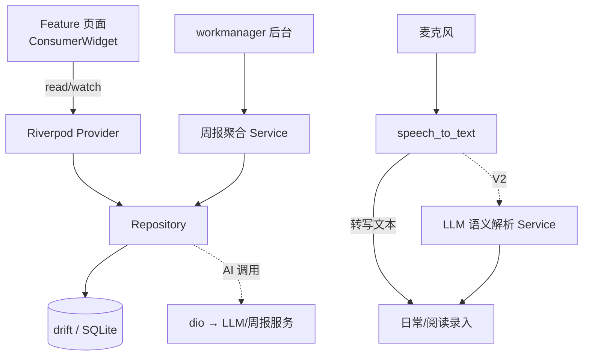
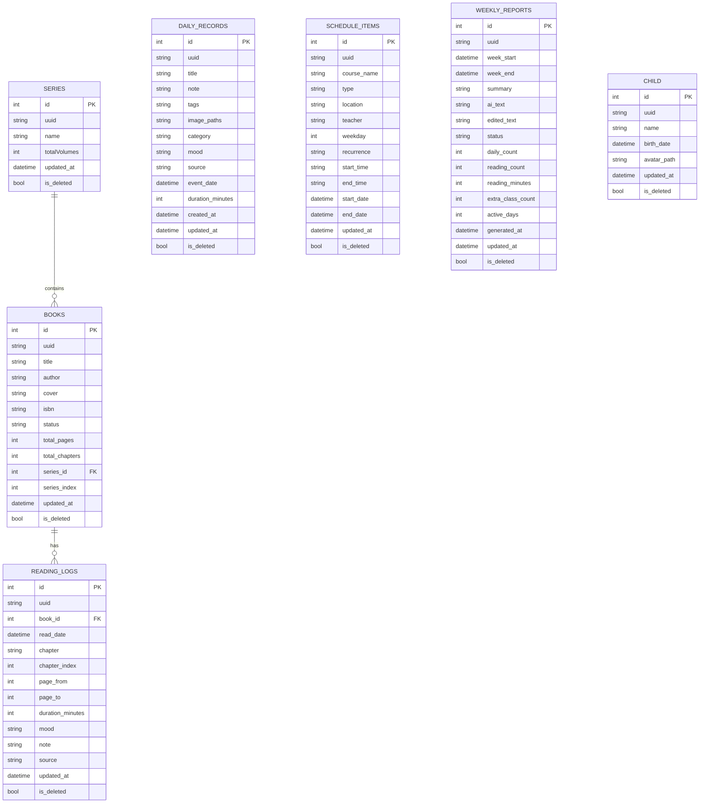
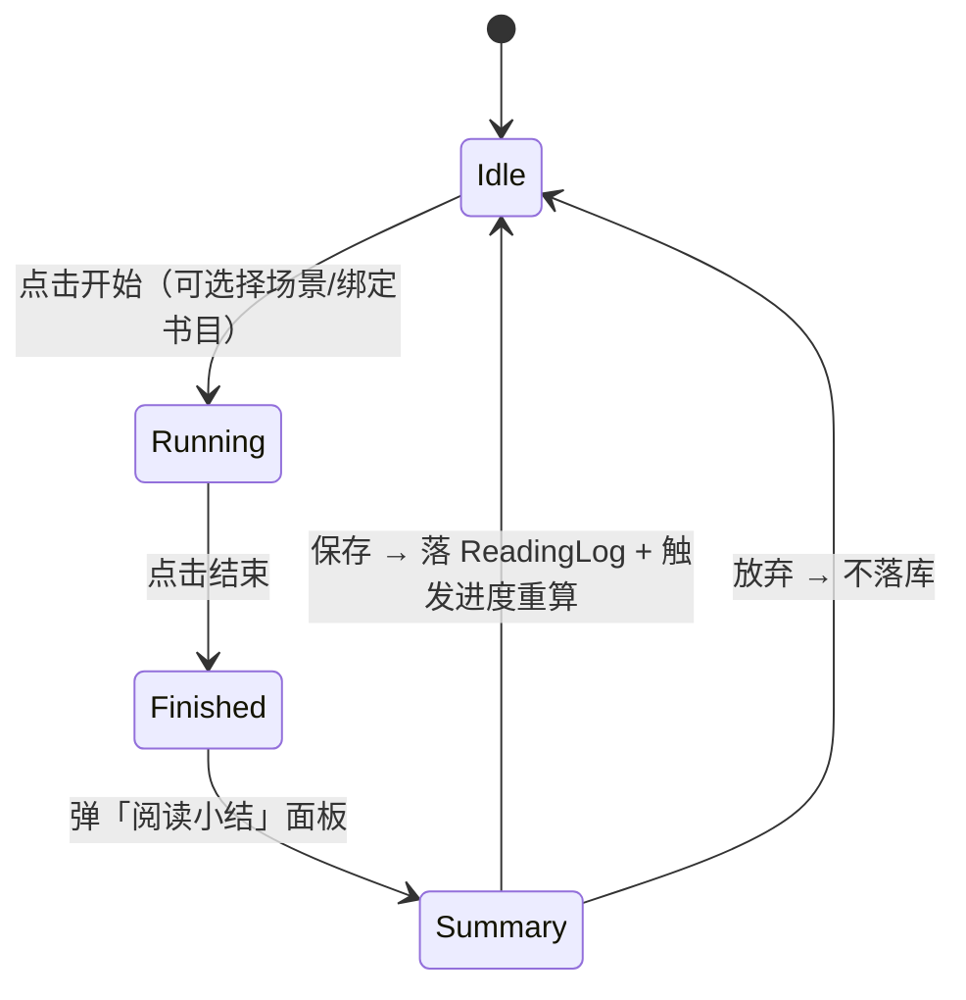
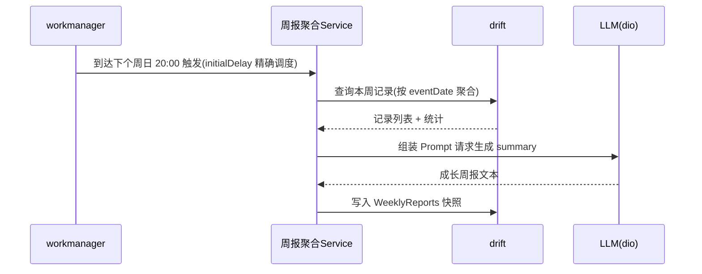
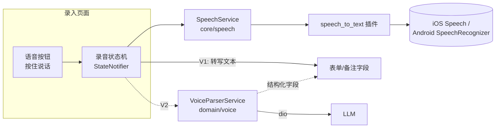
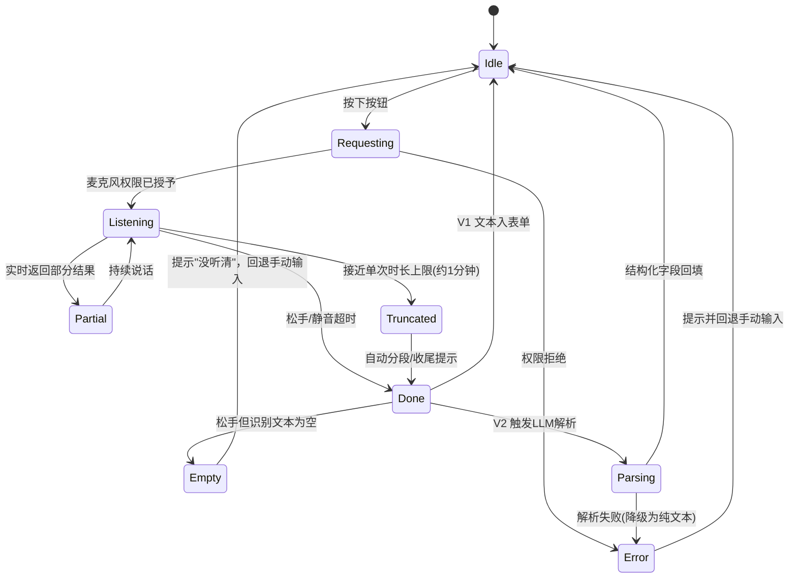

# Sprout 孩子成长记录 App · 技术方案

> 版本：v1.3.2　|　撰写：李硕　|　更新时间：2026-09-03
> 状态：技术设计评审稿
> v1.1 变更：新增「活动计时器」「扫码录入」「书架」三大模块；重构阅读数据模型为 Books / ReadingLogs / Series；课表补周期与学期字段；日常记录补标签与多图；全表加入多端同步预留字段。
> v1.2 变更（第二轮 review 修复）：①新增 `Child` 孩子档案表；②`DailyRecords` 补 `mood`/`eventDate`(独立事件发生日期)/`durationMinutes`；③`WeeklyReports` 补 `aiText`/`editedText`/`status`(draft/published)/`extraClassCount`/`activeDays`；④书目 API 改为 **Open Library**（免费，豆瓣方案移除，中文书降级手填）；⑤LLM API Key 方案 A（存 `shared_preferences`，首次使用引导填写）；⑥周报触发统一为**周日 20:00**；⑦`recurrence` 补 `monthly`；⑧补相册 / 通知权限清单与申请时机；⑨预置标签字典与产品文档统一；⑩补计时会话防杀恢复。
> v1.3 变更（第三轮 review 修复，边界/一致性/工程落地）：①**书架进度口径统一**——进度派生自 `ReadingLogs` 聚合（`已读页 = max(pageTo)`、章节同理），`Books` 不冗余存当前进度，所有入口只追加 `ReadingLog`；②**计时器 MVP 去暂停态**，只保留"开始/结束 + 时间戳"，防杀持久化预留 `accumulatedMinutes`/`pausedAt`（暂停放 V2），并补 6 小时超长上限校验；③`DailyRecords.source` 枚举补 `timer`，与 `ReadingLogs` 对齐；④**路由改用 `StatefulShellRoute.indexedStack`** 承载 4 Tab、各分支独立返回栈，补齐计时器/书架/书籍详情/当日详情/onboarding/设置/我的等路由节点；⑤**workmanager** 周报触发改为 `initialDelay` 计算到下个周日 20:00 + 触发后重排（cron 仅语义示意），补后台 isolate 独立初始化数据层说明；⑥**补偿生成**改为扫描最近 N 周所有缺失快照并补齐（幂等以 `weekStart` 去重）；⑦周报**按 `eventDate` 聚合**，补填过去周需手动重生成；`published` 后重新生成给覆盖 `editedText` 提示；⑧补 `flutter_local_notifications`/`share_plus`/`permission_handler` 依赖；⑨**drift `beforeOpen` 开启 `PRAGMA foreign_keys = ON`** + 定义级联删除；⑩套书进度统一为聚合派生（`count(Books where seriesId & status=done)`）、删增量写；⑪`Books.status` 自动跃迁规则（want→reading→done，手动优先）；⑫Riverpod 拆出只读 `bookShelfService` 消除 reading↔series 循环依赖；⑬扫码补 ISBN 格式/校验位校验、区分"无网络"与"查无结果"；⑭onboarding 建档案不可跳过 + 完成标志 `redirect` 守卫；⑮语音补长语音超时截断与空结果处理。
> v1.3.1 变更：为关键设计点补可直接落地的 Dart 代码骨架——路由（`StatefulShellRoute.indexedStack` + redirect 守卫，§3.2.1）、书架聚合（`BookShelfService` JOIN+GROUP BY 派生进度，§3.4）、`status` 跃迁（`ReadingRepository.addLog`，§5.3）、计时会话防杀持久化（`TimerSessionController`，§5.6）、周报调度（`initialDelay` 自重排 + 后台 isolate 独立初始化，§6.1）、ISBN 校验位（§8.3）。
> v1.3.2 变更（第四轮 review 修复，代码骨架与文档一致性）：①§5.7 章节进度口径 `max(chapter序号)`→`max(chapterIndex)`、方法名 `bookShelfView()`→`watchShelf()`，与 §4.2 表结构、§3.4 骨架统一；②§3.4 旁注由"需补 chapterIndex"改为"已定义"（字段实已落 §4.1/§4.2）；③`Child.birthDate` 显式标注 nullable（可后补，缺失时周报称呼降级）；④课外班"多选周几"明确落库口径为**拆多行 `ScheduleItems`**（§4.2/§5.4，不引入 `weekdays[]`）；⑤`addLog` 骨架状态写回补 `updatedAt`（同步预留一致性）。同步修复产品文档 §5.3"套书口径 +1 册"残留增量记账表述（改为聚合派生）。

---

## 1. 背景与目标

### 1.1 项目背景

Sprout 是一款面向**家长**的孩子成长记录 App，当前记录对象为一名 6 岁儿童，后期规划让孩子本人也能参与使用。产品定位是"轻量、快速、可沉淀"的家庭成长档案工具，帮助家长把碎片化的日常、阅读、课程等信息结构化地记录下来，并通过 AI 周报把零散记录自动汇总成有温度的成长回顾。

### 1.2 核心功能范围

| 模块 | 说明 |
| --- | --- |
| 课表管理 | 维护孩子每周固定课程（学校课表 + 课外班，支持周期规则与学期范围） |
| 日常事项记录 | 记录晚上 / 周末的日常点滴，支持文字、**多图**、**标签**，**并新增语音快速记录** |
| 阅读记录 | 书单管理 + 章节 / 页数进度打卡 + 阅读时长统计（Books / ReadingLogs 拆分） |
| **活动计时器（本次新增）** | 点击开始 / 结束自动记录时长，阅读场景联动书目 + 章节，结束弹「阅读小结」面板并回写书架进度 |
| **书架（本次新增）** | 仿实体书架，按 在读 / 想读 / 已读完 分区可视化，展示封面 + 进度环 + 累计时长 + 最近阅读，支持套书分册 |
| **扫码录入（本次新增）** | 扫 ISBN 条形码，经 Open Library API 拉取书目信息，中文书 / 未命中降级手动搜索 / 手填 |
| 日历视图 | 以日历为入口浏览所有维度的历史记录 |
| AI 周报 | 每周后台自动汇总本周记录，生成成长周报 |
| 语音输入 | 家长腾不出手时通过语音快速录入记录，V1 系统转写、V2 LLM 结构化解析 |

### 1.3 设计目标与约束

- **本地优先（Local-First）**：核心数据全部落地本地 SQLite，无网络也能完整使用，保护儿童隐私。
- **录入极致快**：从"想记录"到"记录完成"路径尽可能短，语音输入是本目标的关键抓手。
- **可演进**：架构需支撑从"家长单人使用"到"多设备 / 孩子参与 / 云同步"的平滑演进，避免早期过度设计。
- **儿童数据合规**：涉及未成年人信息，隐私与数据安全优先级高于功能丰富度。

---

## 2. 技术选型（方案选型）

### 2.1 选型总览

| 领域 | 选型 | 版本 | 定位 |
| --- | --- | --- | --- |
| 跨端框架 | **Flutter** | SDK ≥ 3.3.0 | iOS + Android 一套代码 |
| 状态管理 | **Riverpod** (`flutter_riverpod`) | ^2.5.1 | 依赖注入 + 响应式状态 |
| 路由 | **go_router** | ^13.0.0 | 声明式路由 |
| 本地数据库 | **drift** (SQLite) | ^2.18.0 | 类型安全的结构化存储 |
| 轻量存储 | **shared_preferences** | ^2.2.3 | 配置 / 偏好项 |
| 图片选择 | **image_picker** | ^1.1.2 | 相册 / 拍照 |
| 后台任务 | **workmanager** | ^0.5.2 | 周报定时触发 |
| 本地通知 | **flutter_local_notifications** | ^17.x（建议） | 周报生成后本地通知 |
| 文件导出 / 分享 | **share_plus** | ^9.x（建议） | 备份 / 导出分享 |
| 运行时权限 | **permission_handler** | ^11.x（建议） | 通知 / 相册显式授权与状态查询 |
| 网络请求 | **dio** | ^5.4.3+1 | AI 周报 / 语音语义解析 / 书目查询调用 |
| 国际化 / 日期 | **intl** | ^0.19.0 | 日期格式化 |
| 语音输入（新增） | **speech_to_text** | ^6.6.x（建议） | 系统原生语音转文字 |
| 扫码录入（新增） | **mobile_scanner** | ^5.x（建议） | ISBN 条形码扫描 |
| 日历视图（建议） | **table_calendar** | ^3.1.x（可选） | 日历打点与下钻 |

> 上表中 `speech_to_text`、`mobile_scanner`、`table_calendar`、`flutter_local_notifications`、`share_plus`、`permission_handler` 为本次新增引入，其余均已在 `pubspec.yaml` 中锁定。书目查询复用 `dio`，无需新增网络库。`permission_handler` 统一收口通知 / 相册等需显式弹窗的权限；相机 / 麦克风 / 语音识别权限分别由 `mobile_scanner` / `speech_to_text` 内部触发，`permission_handler` 仅用于状态查询与"引导去系统设置"。

### 2.2 关键选型对比与理由

#### 2.2.1 跨端框架：Flutter

| 候选 | 优势 | 劣势 | 结论 |
| --- | --- | --- | --- |
| **Flutter** | 一套代码双端；自绘引擎 UI 一致性高；动画 / 日历等自定义 UI 表现好；生态完善 | 包体略大 | ✅ 采用 |
| React Native | 生态大、可复用 Web 技能 | 桥接性能损耗、原生一致性弱于 Flutter | ❌ |
| 原生双端 | 性能与体验上限最高 | 双倍开发成本，家庭级项目投入过重 | ❌ |

**结论**：家庭工具型 App 强调开发效率与双端一致体验，Flutter 是最优解。

#### 2.2.2 状态管理：Riverpod

- 相比 Provider：编译期安全，`ProviderScope` 可测试性强，无需 `BuildContext` 即可读取。
- 相比 Bloc：样板代码更少，适合本项目"仓库 + 页面状态"这种中等复杂度。
- 已在 `main.dart` 用 `ProviderScope` 包裹，`app.dart` 用 `ConsumerWidget` 消费，数据库与各 Repository 均以 `Provider` 暴露，选型落地一致。

#### 2.2.3 本地数据库：drift

| 候选 | 特点 | 结论 |
| --- | --- | --- |
| **drift** | 基于 SQLite，编译期生成类型安全 DAO，支持复杂查询 / 迁移 / 响应式流（`watch`） | ✅ 采用 |
| sqflite | 轻但需手写 SQL，类型不安全 | ❌ |
| Hive / Isar | KV / NoSQL 快，但结构化关联查询（如按周聚合）弱 | ❌ |

**结论**：周报需要按时间区间做跨表聚合统计，日历视图需要多维度结构化查询，drift 的关系型能力与类型安全最契合。

#### 2.2.4 后台任务：workmanager

- AI 周报需要"每周固定时间"在后台无感触发，`workmanager` 封装了 Android `WorkManager` 与 iOS `BGTaskScheduler`，是跨端周期任务的标准方案。
- 注意 iOS 后台执行时机由系统调度、不保证精确，需配合"打开 App 时补偿生成"策略（见 §6.3）。

#### 2.2.5 语音输入：speech_to_text（本次新增，详见 §7）

- V1 采用 `speech_to_text` 直接调用 iOS `Speech` / Android `SpeechRecognizer` 系统能力，**零服务端成本、隐私友好、离线可用**（多数机型支持设备端识别）。
- V2 在转写文本之上叠加 LLM 语义解析，把自然语言拆解成结构化字段（如书名 + 章节进度）。

#### 2.2.6 扫码录入：mobile_scanner + Open Library API（本次新增，详见 §8）

| 候选 | 优势 | 劣势 | 结论 |
| --- | --- | --- | --- |
| **mobile_scanner** | 双端统一 API、基于原生 MLKit / AVFoundation、条形码识别快、维护活跃 | 需相机权限 | ✅ 采用 |
| flutter_barcode_scanner | 集成简单 | 维护停滞、可定制性弱 | ❌ |

- **书目数据源（决策：免费方案 Open Library）**：采用 **Open Library**（`openlibrary.org`，免费开放 API，无需鉴权，英文书覆盖全）：
  - 按 ISBN 查询 `https://openlibrary.org/isbn/{isbn}.json` 回填书名 / 作者 / 封面 / 总页数；封面走 `covers.openlibrary.org`。
  - **中文书降级手动填**：Open Library 对中文书覆盖有限，未命中时（多为中文绘本 / 套装）直接转手动录入，家长手填书名 / 作者 / 页数。
  - 三级降级：**扫码自动带出 → 关键词手动搜索 → 纯手工填写**，任一环失败都不阻断录入。
- **注意**：Open Library 为境外服务、部分书目 / 封面可能缺失或访问偏慢，须在 `data/remote/` 做统一封装 + 超时 / 重试 / 本地缓存，且**总页数常缺失**（书架进度环降级策略见 §5.7）；中文书以手填为主。

---

## 3. 整体架构

### 3.1 分层架构

采用经典的**三层分层架构（Presentation / Domain / Data）**，配合 Riverpod 做依赖注入，保证 UI 与数据解耦、易测试、易演进。

```
┌─────────────────────────────────────────────────────────┐
│                    Presentation 表现层                     │
│   features/{home,daily,reading,schedule,report}           │
│   Widget (ConsumerWidget) + Page State (StateNotifier)    │
└───────────────────────────┬─────────────────────────────┘
                            │ watch / read (Riverpod)
┌───────────────────────────▼─────────────────────────────┐
│                     Domain 领域层                          │
│   models/ (实体)  +  service/ (周报聚合、语音语义解析)       │
└───────────────────────────┬─────────────────────────────┘
                            │ 依赖抽象
┌───────────────────────────▼─────────────────────────────┐
│                      Data 数据层                           │
│   repositories/ (仓库)  →  local/ (drift DB) + remote(dio) │
└─────────────────────────────────────────────────────────┘
```

- **Presentation**：只负责渲染与交互，通过 Riverpod `watch` 订阅状态，`read` 触发动作。
- **Domain**：领域实体（`DailyRecord` / `WeeklyReport` 等）与领域服务（周报聚合、语音解析），不依赖具体 UI 与存储实现。
- **Data**：Repository 屏蔽数据来源，本地走 drift，远程（AI）走 dio。

### 3.2 目录结构（现状 + 规划）

```
lib/
├── main.dart                      # 入口：ProviderScope
├── app.dart                       # MaterialApp.router
├── core/                          # 基础设施（无业务）
│   ├── router/app_router.dart     # go_router 路由表
│   ├── theme/app_theme.dart       # M3 主题（seed 绿色）
│   └── utils/date_util.dart       # 日期工具（周起止计算等）
├── data/                          # 数据层
│   ├── local/
│   │   ├── app_database.dart      # drift 表定义 + DB
│   │   └── database_provider.dart # DB 的 Riverpod Provider
│   ├── models/                    # 领域实体
│   └── repositories/              # 各业务仓库
├── shared/                        # 跨模块复用 UI
│   └── widgets/empty_placeholder.dart
└── features/                      # 按业务分层
    ├── home/                      # 首页 / 日历入口
    ├── daily/                     # 日常记录
    ├── reading/                   # 阅读打卡
    ├── bookshelf/                 # 书架（新增）
    ├── schedule/                  # 课表
    └── report/                    # 周报
新增（本方案）：
    ├── app/main_shell.dart        # StatefulShellRoute 承载底部 4 Tab 的骨架页
    ├── features/onboarding/       # 首启引导（建孩子档案），顶层路由 + redirect 守卫
    ├── features/profile/          # "我的" Tab（课表 / 周报 / 设置 / 备份入口）
    ├── features/settings/         # 设置（孩子信息、标签管理、周报时间、AI Key）
    ├── features/timer/            # 活动计时器页
    ├── features/bookshelf/book_detail_page.dart # 书籍详情（进度 + 打卡历史）
    ├── features/home/day_detail_page.dart       # 当日详情页
    ├── core/speech/               # 语音输入基础能力封装
    ├── core/scanner/              # 扫码（ISBN）基础能力封装
    ├── core/timer/                # 活动计时器（ActivitySession）
    ├── core/notification/         # 本地通知封装（flutter_local_notifications）
    ├── core/permission/           # 权限查询与引导（permission_handler）
    ├── data/remote/book_api_client.dart  # Open Library 书目 API 客户端（dio）
    ├── domain/bookshelf/          # 书架/套书只读聚合 Service（消除循环依赖）
    ├── domain/report/             # 周报聚合服务
    └── domain/voice/              # V2 语音语义解析服务
```

### 3.2.1 路由与导航栈设计（`StatefulShellRoute.indexedStack`）

产品定义底部 **4 Tab**（日历 / 记录 / 阅读 / 我的），课表 / 周报 / 设置 / 备份挂在"我的"下。为保证**各 Tab 独立返回栈、底部栏常驻、Tab 间切换不丢栈**，路由采用 `StatefulShellRoute.indexedStack`（替代现状的 5 个平铺 `GoRoute` + `context.push`）：

```
GoRouter
├── /onboarding                      # 顶层独立路由（无底部栏）；由 redirect 守卫决定是否强制进入
└── StatefulShellRoute.indexedStack  # 底部 4 Tab 骨架（MainShell）
    ├── Branch[0] navigatorKey=_calKey   /calendar
    │       └── /calendar/day/:date       # 当日详情（分支内子路由，入本分支栈）
    ├── Branch[1] navigatorKey=_recKey   /records
    │       └── /records/timer            # 活动计时器（分支内子路由）
    ├── Branch[2] navigatorKey=_readKey  /reading
    │       └── /reading/book/:id         # 书籍详情（分支内子路由）
    └── Branch[3] navigatorKey=_mineKey  /mine
            ├── /mine/schedule            # 课表管理
            ├── /mine/reports             # 周报列表
            │     └── /mine/reports/:id   # 周报详情
            └── /mine/settings            # 设置
```

- **各 Branch 独立 `navigatorKey`**：进入二级页（书籍详情 / 计时器 / 周报详情）压入**本分支栈**，切 Tab 不清栈、返回键只在当前分支回退。
- **onboarding 用顶层路由 + `redirect` 守卫**：`GoRouter.redirect` 读取 `shared_preferences` 的 `onboarded` 标志（或 `Child` 表是否有记录），未完成时强制跳 `/onboarding`；完成后 `context.go('/calendar')` 进入主 Shell。
- **模态而非路由页**：阅读小结、撒花庆祝、快速记录面板等用 `showModalBottomSheet` / `showDialog`，**不入路由栈**，避免污染返回栈与深层嵌套。
- **落地改造**：现状 `home_page.dart` 的宫格 + `context.push` 改为 `MainShell` + 分支导航（`branch.goBranch` / `context.go`）。

**代码骨架（`core/router/app_router.dart`）**：

```dart
final _rootKey = GlobalKey<NavigatorState>();
final _calKey = GlobalKey<NavigatorState>();
final _recKey = GlobalKey<NavigatorState>();
final _readKey = GlobalKey<NavigatorState>();
final _mineKey = GlobalKey<NavigatorState>();

final appRouterProvider = Provider<GoRouter>((ref) {
  return GoRouter(
    navigatorKey: _rootKey,
    initialLocation: '/calendar',
    // onboarding 状态变化时驱动 redirect 重算（onboardedProvider 暴露一个 Listenable）
    refreshListenable: ref.watch(onboardedListenableProvider),
    // 未建孩子档案 → 强制进 onboarding；已建档但停留在 onboarding → 放行到主界面
    redirect: (context, state) {
      final onboarded = ref.read(onboardedProvider); // bool，读 SharedPreferences/Child 表
      final atOnboarding = state.matchedLocation == '/onboarding';
      if (!onboarded) return atOnboarding ? null : '/onboarding';
      if (atOnboarding) return '/calendar';
      return null;
    },
    routes: [
      GoRoute(
        path: '/onboarding',
        parentNavigatorKey: _rootKey, // 顶层路由，无底部栏
        builder: (c, s) => const OnboardingPage(),
      ),
      StatefulShellRoute.indexedStack(
        builder: (c, s, shell) => MainShell(shell: shell), // 底部 4 Tab 骨架
        branches: [
          StatefulShellBranch(navigatorKey: _calKey, routes: [
            GoRoute(path: '/calendar', builder: (c, s) => const CalendarPage(), routes: [
              GoRoute(path: 'day/:date', builder: (c, s) => DayDetailPage(date: s.pathParameters['date']!)),
            ]),
          ]),
          StatefulShellBranch(navigatorKey: _recKey, routes: [
            GoRoute(path: '/records', builder: (c, s) => const RecordsPage(), routes: [
              GoRoute(path: 'timer', builder: (c, s) => const TimerPage()),
            ]),
          ]),
          StatefulShellBranch(navigatorKey: _readKey, routes: [
            GoRoute(path: '/reading', builder: (c, s) => const BookshelfPage(), routes: [
              GoRoute(path: 'book/:id', builder: (c, s) => BookDetailPage(id: int.parse(s.pathParameters['id']!))),
            ]),
          ]),
          StatefulShellBranch(navigatorKey: _mineKey, routes: [
            GoRoute(path: '/mine', builder: (c, s) => const ProfilePage(), routes: [
              GoRoute(path: 'schedule', builder: (c, s) => const SchedulePage()),
              GoRoute(path: 'reports', builder: (c, s) => const ReportListPage(), routes: [
                GoRoute(path: ':id', builder: (c, s) => ReportDetailPage(id: int.parse(s.pathParameters['id']!))),
              ]),
              GoRoute(path: 'settings', builder: (c, s) => const SettingsPage()),
            ]),
          ]),
        ],
      ),
    ],
  );
});

// 底部导航骨架：indexedStack 保各分支独立返回栈
class MainShell extends StatelessWidget {
  const MainShell({super.key, required this.shell});
  final StatefulNavigationShell shell;

  @override
  Widget build(BuildContext context) {
    return Scaffold(
      body: shell,
      bottomNavigationBar: NavigationBar(
        selectedIndex: shell.currentIndex,
        // initialLocation:true → 再次点当前 Tab 回到该分支根，符合 Tab 语义
        onDestinationSelected: (i) => shell.goBranch(i, initialLocation: i == shell.currentIndex),
        destinations: const [
          NavigationDestination(icon: Icon(Icons.calendar_month), label: '日历'),
          NavigationDestination(icon: Icon(Icons.edit_note), label: '记录'),
          NavigationDestination(icon: Icon(Icons.menu_book), label: '阅读'),
          NavigationDestination(icon: Icon(Icons.person), label: '我的'),
        ],
      ),
    );
  }
}
```

> 阅读小结、撒花庆祝、快速记录面板等用 `showModalBottomSheet` / `showDialog` 弹出，**不注册为路由**，避免污染分支返回栈。

### 3.3 模块依赖与数据流



### 3.4 Riverpod Provider 拓扑

- `appDatabaseProvider`（单例 DB，`onDispose` 关闭）
- `dailyRepositoryProvider` / `readingRepositoryProvider`（含 `Books` + `ReadingLogs`）/ `seriesRepositoryProvider` / `scheduleRepositoryProvider` / `reportRepositoryProvider`（依赖 `appDatabaseProvider`）
- `bookApiClientProvider`（Open Library 书目 API，依赖 dio）
- `appRouterProvider`（`StatefulShellRoute` 路由 + `redirect` 守卫，依赖 `childRepositoryProvider` 判断是否已 onboard）
- 规划新增：`speechServiceProvider`（语音能力）、`scannerServiceProvider`（扫码）、`timerSessionProvider`（活动计时器状态机）、`reportGeneratorProvider`（周报聚合）、`voiceParserProvider`（V2 语义解析）、`bookShelfServiceProvider`（书架/套书只读聚合）、`notificationServiceProvider`（本地通知）
- 页面状态用 `StateNotifierProvider` / `AsyncNotifierProvider` 承载列表加载、录音状态机、计时状态机、书架视图流等。

> **循环依赖规避（Q）**：书架卡片进度、套书"已读完册数"这类**跨 `Books` + `ReadingLogs` + `Series` 的聚合**，统一收敛到只读的 `bookShelfServiceProvider`（只依赖 `appDatabaseProvider` 做联表查询、**不反向持有任何 Repository**）。`readingRepository` 与 `seriesRepository` 之间**保持 series 只被 reading 单向依赖**（reading 写 `Books.seriesId`），严禁 `series` 反向 `ref.watch(readingRepositoryProvider)`，从源头消除 reading↔series 循环依赖运行时异常。

**代码骨架（`domain/bookshelf/book_shelf_service.dart`）**——单次 `JOIN + GROUP BY` 派生进度，避免逐本 N+1：

```dart
/// 单本书的书架视图（进度全部由 ReadingLogs 聚合派生，Books 不存当前进度）
class BookShelfItem {
  final Book book;
  final int? maxPage;      // max(pageTo)
  final int? maxChapter;   // max(chapterIndex)
  final int logCount;      // 打卡次数
  final int totalMinutes;  // sum(durationMinutes)
  final DateTime? lastReadAt;
  const BookShelfItem({required this.book, this.maxPage, this.maxChapter,
      required this.logCount, required this.totalMinutes, this.lastReadAt});

  /// 进度三档降级：页 > 章 > 打卡次数
  double? get progress {
    if (book.totalPages != null && book.totalPages! > 0 && maxPage != null) {
      return (maxPage! / book.totalPages!).clamp(0.0, 1.0);
    }
    if (book.totalChapters != null && book.totalChapters! > 0 && maxChapter != null) {
      return (maxChapter! / book.totalChapters!).clamp(0.0, 1.0);
    }
    return null; // 两者皆无 → UI 展示打卡次数图标
  }
}

class BookShelfService {
  BookShelfService(this._db);
  final AppDatabase _db;

  /// 一次 JOIN Books ⨝ ReadingLogs + GROUP BY，避免每本书各跑一次聚合
  Stream<List<BookShelfItem>> watchShelf() {
    final logs = _db.readingLogs;
    final books = _db.books;
    final maxPage = logs.pageTo.max();
    final maxChap = logs.chapterIndex.max();
    final cnt = logs.id.count();
    final mins = logs.durationMinutes.sum();
    final last = logs.readDate.max();

    final query = _db.select(books).join([
      leftOuterJoin(logs, logs.bookId.equalsExp(books.id) & logs.isDeleted.equals(false)),
    ])
      ..where(books.isDeleted.equals(false))
      ..groupBy([books.id])
      ..orderBy([OrderingTerm.desc(last)]);

    return query.watch().map((rows) => rows.map((r) => BookShelfItem(
          book: r.readTable(books),
          maxPage: r.read(maxPage),
          maxChapter: r.read(maxChap),
          logCount: r.read(cnt) ?? 0,
          totalMinutes: r.read(mins) ?? 0,
          lastReadAt: r.read(last),
        )).toList());
  }

  /// 套书进度 = 已读完分册数 / 总册数（实时聚合，不冗余存字段、不增量写）
  Future<double> seriesProgress(int seriesId) async {
    final series = await (_db.select(_db.series)..where((s) => s.id.equals(seriesId))).getSingle();
    final done = _db.books.id.count();
    final q = _db.selectOnly(_db.books)
      ..addColumns([done])
      ..where(_db.books.seriesId.equals(seriesId) &
          _db.books.status.equals('done') &
          _db.books.isDeleted.equals(false));
    final finished = await q.map((r) => r.read(done) ?? 0).getSingle();
    return series.totalVolumes == 0 ? 0 : (finished / series.totalVolumes).clamp(0.0, 1.0);
  }
}

final bookShelfServiceProvider = Provider<BookShelfService>(
    (ref) => BookShelfService(ref.watch(appDatabaseProvider)));
```

> `ReadingLogs.chapterIndex`(int, nullable) 已在 §4.1/§4.2 定义，用于章节进度聚合排序（`chapter` 仅作展示串）；`status` 跃迁（want→reading→done、手动优先）在 `ReadingRepository.addLog()` 里落库时判定，不在此只读 Service 内写。

---

## 4. 数据模型设计

> 本次重构要点：①阅读拆分为 `Books`（书单主表）+ `ReadingLogs`（打卡明细）+ `Series`（套书）；②日常记录补 `tags` / 多图 / `mood` / `category` / `eventDate`（独立事件发生日期）/ `durationMinutes`；③课表补 `type` / `recurrence`（含 `monthly`）/ 起止日期 / `teacher`；④**新增 `Child` 孩子档案表**（供周报注入年龄/称呼、V2 多孩子切换）；⑤周报补 `aiText` / `editedText` / `status`(draft/published) / `extraClassCount` / `activeDays`；⑥**所有业务表统一加入多端同步预留字段** `uuid` / `updatedAt` / `isDeleted`（软删）。

### 4.1 ER 概览



`Series 1—N Books 1—N ReadingLogs`；周报仍通过时间区间 `[week_start, week_end)` 对 `DailyRecords` 与 `ReadingLogs` 做聚合。

### 4.2 表结构（drift `Table` 定义）

| 表 | 关键字段 | 用途 |
| --- | --- | --- |
| `Series`（套书，新增） | `name` / `totalVolumes` | 套书主表；`totalVolumes` 供套书进度。**套书"已读完册数"不冗余存字段**，实时聚合 `count(Books where seriesId=X and status='done')`，进度 = 已读完册数 ÷ `totalVolumes` |
| `Books`（书单，重构） | `title` / `author` / `cover` / `isbn` / `status`(want/reading/done) / `totalPages` / `totalChapters` / `seriesId`(FK, nullable) / `seriesIndex` | 书单主表，支撑书架三分区、进度环、封面、套书分册。**`status` 自动跃迁规则**：新建默认 `want`；首次追加 `ReadingLog` 自动 `want→reading`；小结标记读完或手动置 `done`；**家长手动改 `status` 优先级最高**（打卡不会把手动置 `done` 的书退回 `reading`）。`Books` **不存"当前已读页/章"**，进度一律由 `ReadingLogs` 聚合派生（见 §5.7） |
| `ReadingLogs`（打卡，重构） | `bookId`(FK) / `readDate` / `chapter`(展示串) / `chapterIndex`(int,nullable,聚合排序用) / `pageFrom` / `pageTo` / `durationMinutes` / `mood` / `note` / `source`(manual/voice/timer) | 每次阅读打卡明细；累计供进度环、阅读时长、最近阅读时间。进度口径：`已读页 = max(pageTo)`、`已读章 = max(chapterIndex)` |
| `DailyRecords`（重构） | `title` / `note` / `tags`(JSON 数组) / `imagePaths`(JSON 多图) / `mood`(心情) / `category`(evening/weekend/other) / `source`(**manual/voice/timer**) / `eventDate`(事件发生日期) / `durationMinutes`(计时通用活动时长) / `createdAt` | 日常事项，标签供周报分维度聚合、日历分类着色。**`eventDate` 独立于 `createdAt`**：日历/周报按事件发生日聚合，支持"事后补填过去某天"；`createdAt` 仅作创建审计。计时器通用活动结束落此表并写 `durationMinutes`、`source=timer` |
| `ScheduleItems`（重构） | `courseName` / `type`(school/extra) / `location` / `teacher` / `weekday`(1–7) / `recurrence`(weekly/biweekly/monthly) / `startTime` / `endTime` / `startDate` / `endDate` | 学校课表 + 课外班，支持每周 / 隔周 / 每月周期与学期范围。**每条仅存单个 `weekday`**；产品侧"课外班可多选周几（如每周二 / 四）"在落库时**拆成多行 `ScheduleItems`**（每个 weekday 一行，共享 courseName / 时段 / 地点 / 老师等），与单值 `weekday` 模型保持一致，不引入 `weekdays[]` 列 |
| `WeeklyReports` | `weekStart` / `weekEnd` / `summary`(结构化 JSON) / `aiText`(AI 原文) / `editedText`(家长编辑版) / `status`(draft/published) / `dailyCount` / `readingCount` / `readingMinutes` / `extraClassCount`(课外班次数) / `activeDays`(活跃天数) / `generatedAt` | 周报快照，冗余统计字段避免重复计算。`aiText` 保留 AI 原文以支持"恢复原版"，`editedText` 存家长手改内容，`status` 标记草稿/已发布 |
| `Child`（孩子档案，新增） | `name`(必填) / `birthDate`(**nullable，可后补**) / `avatarPath`(nullable) | 孩子基本信息，供周报注入年龄 / 称呼、V2 多孩子切换；V1 单孩子只存一行。`birthDate` 缺失时周报年龄 / 称呼降级为"孩子 / 宝贝" |

> **同步预留**：以上所有业务表统一含 `uuid`（TEXT，建表即生成）、`updatedAt`（DateTime）、`isDeleted`（bool，默认 false，软删）。V1 本地即写入，V2 多端同步直接复用，无需再次全表迁移。

### 4.3 迁移策略

当前代码 `schemaVersion = 1`（旧 4 表扁平结构）。本次重构落地需通过 drift `MigrationStrategy` 升级：

- **`schemaVersion` 升至 2**：新增 `Series` 与 `Child`；重构 `BookRecords` → `Books` + `ReadingLogs`（旧数据按 `bookName` 归并建 `Books`，每条旧记录转 1 条 `ReadingLog`）；`DailyRecords` 加 `tags/imagePaths/mood/category/eventDate/durationMinutes`（`eventDate` 用旧 `createdAt` 回填）；`ScheduleItems` 加 `type/recurrence/startDate/endDate/teacher`；`WeeklyReports` 加 `aiText/editedText/status/extraClassCount/activeDays`；全表加 `uuid/updatedAt/isDeleted`。
- **迁移原则**：只增不删、字段默认值兜底、旧数据无损转换、升级前自动备份 DB 文件、补充迁移单测。
- **推荐（MVP 首选）**：因 MVP 尚在开发期、真实数据量小，**直接以 v2 结构建库**（`schemaVersion=2` 起步），跳过 v1→v2 数据搬迁与迁移单测，成本最低、风险最小。仅当已有真实用户数据需保留时才走上面的 `MigrationStrategy` 路径。若走直接建库路径，`onCreate` 需一次性建齐全部 v2 表。
- **外键约束必须显式开启**：drift / SQLite **默认 `PRAGMA foreign_keys = OFF`**，若不开启，ER 里的 `Books.seriesId`、`ReadingLogs.bookId` 外键形同虚设——删套书后分册 `seriesId` 悬空、删书后 `ReadingLogs` 变孤儿。因此 `MigrationStrategy.beforeOpen` 内必须执行 `await customStatement('PRAGMA foreign_keys = ON');`（每次打开连接都要执行，含后台 isolate）。
- **级联删除策略**：`ReadingLogs.bookId` 外键设 `onDelete: KeyAction.cascade`（删书自动清打卡）；`Books.seriesId` 外键设 `onDelete: KeyAction.setNull`（删套书主记录时分册降级为独立书、不误删书）。删除统一走**软删**（`isDeleted=true`）为主，物理级联仅作兜底防悬空。

```dart
@override
MigrationStrategy get migration => MigrationStrategy(
      onCreate: (m) => m.createAll(),
      beforeOpen: (details) async {
        await customStatement('PRAGMA foreign_keys = ON');
      },
    );
```

---

## 5. 核心功能模块设计

### 5.1 首页 / 日历视图（home）

- 现状：`HomePage` 为功能宫格入口 + "今天"卡片。
- 规划：引入 `table_calendar`（或自绘）作为主入口，日历上标记有记录的日期（打点），点击某天下钻查看该日的日常 / 阅读 / 课程聚合。
- 数据来源：跨 `DailyRecords` / `Books` + `ReadingLogs` / `ScheduleItems` 按日期聚合，建议在 Repository 层提供 `fetchByDate(DateTime)` 统一接口。

### 5.2 日常记录（daily）

- 现状：`DailyPage` 为空态占位 + FAB。
- 规划：列表按 `eventDate` 倒序（事件发生日期，支持补填过去某天；`createdAt` 仅作创建审计）；录入表单含标题、备注、**多图**（`image_picker` + `imagePaths` JSON）、**标签**（预置字典 **运动 / 才艺 / 出行 / 家务 / 情绪 / 其他**，与产品文档统一，可自定义，`tags` JSON）、**心情**（`mood`）、**语音按钮**、`category`（晚上 / 周末 / 其他，可由 `eventDate` 自动推断）；支持编辑 / 删除（Repository 已具备 `update` / `remove`）。
- 标签是周报"分维度小结"的聚合依据，日历视图按 `category` / 标签分类着色，按 `eventDate` 聚合到对应日期。

### 5.3 阅读记录（reading）

- 现状：`ReadingRepository` 基于扁平 `BookRecords`，需按 §4 重构为 `Books` + `ReadingLogs`。
- 规划：
  - 书单维度（`Books`）：状态 想读 / 在读 / 读完，封面、ISBN、总页数 / 总章节、套书归属；**`Books` 不存"当前已读页/章"**，进度一律由 `ReadingLogs` 聚合派生（口径见 §5.7）；
  - **`status` 自动跃迁**：新建默认 `want`；首次追加 `ReadingLog` → 自动 `want→reading`；小结勾选"读完"或家长手动置 `done`；**家长手动改优先级最高**，打卡不会把手动置 `done` 的书退回 `reading`；
  - 打卡维度（`ReadingLogs`）：单次记录 `bookId` + 章节 / 页码区间 + 时长 + 心情 + 感想，`source` 标记来源（手动 / 语音 / 计时器）；**所有录入入口（手动 / 扫码后打卡 / 计时器小结 / V2 语音）只追加 `ReadingLog`，绝不各自回写进度字段**，进度统一由 `bookShelfService` 聚合派生，杜绝多头写导致的数据不一致；
  - 录入来源：**扫码（§8）自动带出书目** + **计时器阅读小结自动流转**（§5.6），家长无需重复填写；
  - 语音录入直达（V2 自动填书名 + 章节）。

**代码骨架（`data/repositories/reading_repository.dart`，`status` 跃迁只在写侧判定）**：

```dart
/// 追加打卡 + 处理 status 自动跃迁（唯一写进度状态的入口）
Future<void> addLog(ReadingLogsCompanion log, {bool markFinished = false}) async {
  await _db.transaction(() async {
    await _db.into(_db.readingLogs).insert(log);
    final bookId = log.bookId.value;
    final book = await (_db.select(_db.books)..where((b) => b.id.equals(bookId))).getSingle();
    String? next;
    if (markFinished) {
      next = 'done';                              // 勾选读完
    } else if (book.status == 'want') {
      next = 'reading';                           // 首次打卡：想读→在读
    }
    // 手动置 done 的书不因打卡退回 reading（手动优先由 UI 的"手动改状态"直写，不走此处）
    if (next != null && next != book.status) {
      await (_db.update(_db.books)..where((b) => b.id.equals(bookId)))
          .write(BooksCompanion(
            status: Value(next!),
            updatedAt: Value(DateTime.now()), // 同步预留：状态变更必刷 updatedAt，否则 V2 同步会漏这条
          ));
    }
  });
}
```

### 5.4 课表管理（schedule）

- 现状：`ScheduleRepository` 已支持 `fetchByWeekday`。
- 规划：区分 `type=school`（学校固定课表，配 `startDate/endDate` 学期范围）与 `type=extra`（课外班，配 `recurrence` 每周 / 隔周 / **每月** + 起止日期 + `teacher`）；`recurrence` 枚举为 `weekly/biweekly/monthly`，`monthly` 按"每月第 N 个周 X"展开（以 `startDate` 所在周为基准）；周视图网格（周一至周日 × 时间段）支持增删课程；首页"今日课程"卡片复用 `fetchByWeekday(today.weekday)`，隔周 / 每月课程按 `startDate` 推算当周是否生效。**课外班"多选周几"**（产品 §P0-4，如每周二 / 四）在保存时**按选中的每个 weekday 各插入一行 `ScheduleItems`**（共享 courseName / 时段 / 地点 / 老师 / 起止日期），因此 `fetchByWeekday` 单值查询即可命中，无需改表；编辑 / 删除时以同一课程分组（可用同一 `uuid` 前缀或补一个 `groupId` 关联，MVP 先按 courseName + 时段分组）整体处理。

### 5.5 周报（report）

- 现状：`ReportRepository` 支持按 `weekStart` 倒序读取。
- 规划：周报列表 + 详情页；详情展示 AI 生成的 `summary` 与本周统计（日常数、阅读次数、阅读分钟数）。详见 §6。

### 5.6 活动计时器（timer，本次新增）

**定位**：把"记录"这件事从"事后回忆填写"变为"实时计时，结束即成记录"，是提升记录准确度与频次的关键抓手。核心闭环：**点击开始 → 计时 → 结束 → 弹小结面板 → 落库 → 回写书架进度**。

**数据落点**：计时会话产出一条 `ReadingLog`（阅读场景）或 `DailyRecord`（通用场景），`source=timer`。阅读场景关键字段：`startAt` / `endAt` / `durationMinutes`（由起止自动算）/ `linkedBookId` / `linkedChapter`。计时会话本身**不落表**，仅进行中态临时持久化到 `shared_preferences`（见下）。

**状态机（`ActivitySession`，`StateNotifier`）**：

> **MVP 去暂停态**：为规避"暂停期间被杀 → 恢复后基于 `startAt` 续算把暂停时长也算进去"的时长失真问题，**MVP 仅保留"开始 / 结束"**，不做暂停 / 继续；暂停能力放 V2（届时持久化补 `accumulatedMinutes` / `pausedAt` 精确扣除暂停跨度）。



**阅读小结面板**：读到第几页 / 第几章、是否读完（勾选 → `Books.status=done`）、心情打卡（`mood`）、感想（选填）。保存后：
- **只追加一条 `ReadingLog`**（含 `pageTo` / `chapter` / `durationMinutes`），**不直接写 `Books` 的进度字段**；
- 进度环由 `bookShelfService` 按 `ReadingLogs` 聚合派生（`已读页 = max(pageTo)`）后触发动画刷新；
- 若勾选读完 → `Books.status=done`，转入已读书架；套书的"已读完册数"实时聚合 `count(Books where seriesId=X and status='done')`，**不做增量写**。

**分层**：`core/timer/` 封装计时（前台计时 + 应用切后台时基于时间戳续算，避免后台被杀导致时长丢失）；`timerSessionProvider` 暴露状态；结束回调交由 `ReadingRepository` / `DailyRepository` 落库。

**进行中会话持久化（防杀恢复）**：计时"开始"即把 `{scene, startAt, linkedBookId}` 写入 `shared_preferences`（并预留 `accumulatedMinutes` / `pausedAt` 字段给 V2 暂停能力，MVP 恒为 0 / null）；App 冷启动检测到存在未结束会话时，弹窗提示"继续计时 / 立即结束并补记 / 放弃"（对应产品"下次进入提示是否结束未完成计时"），避免进程被系统回收导致会话丢失。
- **超长 / 跨天上限校验**：恢复时若 `now - startAt > 6 小时`（阈值可配），判定为"忘记结束"，**不自动落库**，弹窗让家长确认或手填实际时长后再落 `durationMinutes`，避免出现几千分钟的异常记录污染统计与周报。
- **跨天归属**：跨天会话（如 22:00 开始次日结束）按 `startAt` 所在自然日归属，结束时可让用户确认归属日期。

**代码骨架（`core/timer/timer_session.dart`）**：

```dart
const _kTimerKey = 'active_timer_session';
const _kMaxRunHours = 6; // 超长兜底阈值

/// 进行中会话的持久化结构（MVP：pausedAt/accumulatedMinutes 恒为 null/0，预留 V2）
class ActiveTimer {
  final String scene;        // reading | generic
  final DateTime startAt;
  final int? linkedBookId;
  final DateTime? pausedAt;      // 预留 V2
  final int accumulatedMinutes;  // 预留 V2
  const ActiveTimer({required this.scene, required this.startAt, this.linkedBookId,
      this.pausedAt, this.accumulatedMinutes = 0});

  Map<String, dynamic> toJson() => {
        'scene': scene, 'startAt': startAt.toIso8601String(), 'linkedBookId': linkedBookId,
        'pausedAt': pausedAt?.toIso8601String(), 'accumulatedMinutes': accumulatedMinutes,
      };
  factory ActiveTimer.fromJson(Map<String, dynamic> j) => ActiveTimer(
        scene: j['scene'], startAt: DateTime.parse(j['startAt']), linkedBookId: j['linkedBookId'],
        pausedAt: j['pausedAt'] == null ? null : DateTime.parse(j['pausedAt']),
        accumulatedMinutes: j['accumulatedMinutes'] ?? 0,
      );
}

/// 冷启动恢复结果：交给 UI 决定弹窗
enum RestoreAction { none, resume, confirmOverlong }

class TimerSessionController extends StateNotifier<ActiveTimer?> {
  TimerSessionController(this._prefs) : super(null);
  final SharedPreferences _prefs;

  Future<void> start({required String scene, int? linkedBookId}) async {
    final t = ActiveTimer(scene: scene, startAt: DateTime.now(), linkedBookId: linkedBookId);
    state = t;
    await _prefs.setString(_kTimerKey, jsonEncode(t.toJson()));
  }

  /// 结束：返回本次时长（分钟）；超长交由 UI 二次确认，不在此静默落库
  int finish() {
    final t = state;
    if (t == null) return 0;
    final minutes = DateTime.now().difference(t.startAt).inMinutes;
    _clear();
    return minutes;
  }

  /// 冷启动检测未结束会话
  RestoreAction detectOnLaunch() {
    final raw = _prefs.getString(_kTimerKey);
    if (raw == null) return RestoreAction.none;
    final t = ActiveTimer.fromJson(jsonDecode(raw));
    state = t;
    final elapsed = DateTime.now().difference(t.startAt);
    return elapsed.inHours >= _kMaxRunHours ? RestoreAction.confirmOverlong : RestoreAction.resume;
  }

  Future<void> _clear() async { state = null; await _prefs.remove(_kTimerKey); }
}
```

### 5.7 书架（bookshelf，本次新增）

**定位**：以仿实体书架的可视化，直观呈现每本书的阅读状态与信息；数据来自扫码录入 + 计时器阅读小结自动流转，无需重复填写。承载于底部"阅读"Tab 的主视图，不新增 Tab。

**布局与分区**：
- 顶部分段控件：**在读 | 想读 | 已读完**（对应 `Books.status` = reading / want / done）；
- 书本竖排仿书架陈列；每本卡片展示：**封面**（无封面用色块 + 书名）+ **进度环** + **累计阅读时长** + **最近阅读时间**；
- **已读完**书籍加成就感展示（完成勋章 / 微光效果）；
- **套书**：以书套形式聚合，可展开查看各分册及其读完状态。

**进度环三档降级策略（Q5 决策）**：

> **进度口径（单一真相源）**：`Books` **不存当前进度**，一律由 `ReadingLogs` 聚合派生——`已读页 = max(pageTo)`、`已读章 = max(chapterIndex)`（取最大而非累加，避免同章反复读 / 补填历史被重复计数）。所有入口只追加 `ReadingLog`，进度由 `bookShelfService` 统一计算。

| 条件 | 展示 |
| --- | --- |
| 有 `totalPages` | **页数环**：`max(pageTo)` ÷ 总页数 |
| 无总页数、有 `totalChapters` | **章节环**：`max(chapterIndex)` ÷ 总章节 |
| 两者都无 | 不显示环，改为**打卡次数图标**（如 📖 × `count(ReadingLogs)`）+ 累计时长 |

- **套书进度** = **已读完册数 ÷ 总册数**（`totalVolumes`），其中已读完册数实时聚合 `count(Books where seriesId=X and status='done')`（**不冗余存字段、不增量写**）；展开后每册按上表各自计算。
- 累计时长 / 最近阅读时间：对该 `bookId` 的 `ReadingLogs` 做 `sum(durationMinutes)` 与 `max(readDate)` 聚合。**为避免逐本查询的 N+1**，`bookShelfService.watchShelf()` 用**一次 `JOIN Books ↔ ReadingLogs + GROUP BY bookId`** 出全量书架视图，drift `watch` 增量刷新，避免每本书各跑一次聚合。

**数据来源流转**：扫码（§8）→ 建 `Books`；计时器小结（§5.6）→ 追加 `ReadingLogs` + 回写进度 → 书架卡片实时刷新，形成"录一次、处处更新"的闭环。

---

## 6. AI 周报生成方案

### 6.1 触发机制



- **触发实现（重要）**：Android `WorkManager` **不支持 cron 表达式**，`PeriodicWorkRequest` 最小周期 15 分钟且无法精确指定"周日 20:00"。因此采用 **`OneTimeWorkRequest` + `initialDelay`**：每次注册时用 `DateUtil` 计算"当前时刻 → 下个周日 20:00"的延迟；任务**触发后在回调末尾重新排下一周**（自重排链），实现精确到点的"每周日 20:00"。文中出现的 `0 20 * * 0` **仅为语义示意，非实现表达式**。
- **周区间与聚合口径**：周区间由 `DateUtil.startOfWeek` 计算，聚合**本周** `[weekStart, weekEnd)`（周一 00:00 至周日 24:00）数据；**聚合字段一律用 `eventDate`（事件发生日）而非 `createdAt`**，以正确归属"事后补填的过去某天"。
- **后台 isolate 独立初始化（重要）**：workmanager 的 `callbackDispatcher` 运行在**独立后台 isolate**，不共享主 isolate 的 drift 连接、Riverpod 容器与内存态。因此后台任务入口必须**自行重新打开 DB**（`AppDatabase()` + `beforeOpen` 里执行 `PRAGMA foreign_keys = ON`）、**重新从 `shared_preferences` 读取 LLM API Key**，聚合与生成完成后关闭连接；不得假设主 isolate 的 Provider 可用。
- **iOS 平台配置**：需在 `Info.plist` 的 `BGTaskSchedulerPermittedIdentifiers` 注册后台任务标识符，并在 `AppDelegate` 完成 `BGTaskScheduler` 注册；iOS 后台调度不保证精确到点、最小间隔约 15 分钟且系统择机执行（可能数天不跑），故必须叠加"打开 App 时补偿生成"策略（见 §6.3）——补偿生成是主力，后台调度是加速。

**代码骨架（`domain/report/report_scheduler.dart`）**——`initialDelay` 精确到点 + 触发后自重排 + 后台 isolate 独立初始化：

```dart
const _kWeeklyTask = 'weekly_report_task';

/// 计算"现在 → 下一个周日 20:00"的延迟
Duration nextSunday20(DateTime now) {
  var t = DateTime(now.year, now.month, now.day, 20);
  final daysToSun = (DateTime.sunday - now.weekday + 7) % 7; // 周一=1..周日=7
  t = t.add(Duration(days: daysToSun));
  if (!t.isAfter(now)) t = t.add(const Duration(days: 7)); // 已过点则顺延一周
  return t.difference(now);
}

/// 注册（每次触发后回调里再次调用，形成自重排链）
Future<void> scheduleWeekly() => Workmanager().registerOneOffTask(
      _kWeeklyTask, _kWeeklyTask,
      initialDelay: nextSunday20(DateTime.now()),
      existingWorkPolicy: ExistingWorkPolicy.replace,
    );

@pragma('vm:entry-point')
void callbackDispatcher() {
  Workmanager().executeTask((task, _) async {
    // 后台 isolate 不共享主 isolate 依赖：自行开 DB + 读 Key
    final db = AppDatabase();                       // beforeOpen 内已 PRAGMA foreign_keys=ON
    final prefs = await SharedPreferences.getInstance();
    final apiKey = prefs.getString('llm_api_key');
    try {
      await ReportGenerator(db, apiKey).generateForWeek(DateUtil.startOfThisWeek());
    } finally {
      await db.close();                             // 用完即关，避免 isolate 泄漏
      await scheduleWeekly();                        // 自重排下一周
    }
    return true;
  });
}
```

### 6.2 生成流程（三步）

1. **聚合**：跨表统计 `dailyCount` / `readingCount` / `readingMinutes` / `extraClassCount`（课外班次数）/ `activeDays`（有记录的天数），并抽取本周记录要点（标题、书名、感想）；结构化结果存 `summary`(JSON)。
2. **生成**：将统计 + 要点 + **孩子年龄/称呼（读 `Child` 表）** 组装成 Prompt，经 `dio` 调用 LLM，产出自然语言文本存入 `aiText`（温暖、面向家长的口吻）。
3. **落库**：写入 `WeeklyReports`，`status=draft`，冗余统计字段随快照保存。家长若手动编辑，改动存 `editedText`；"恢复 AI 原版"即回退到 `aiText`；家长确认后置 `status=published`。

**快照一致性与重新生成策略**：周报是**冗余统计快照**，若家长在生成后又补填 / 删除了本周记录，快照会与实际不一致，需支持"重新生成"刷新。规则：
- **`status=draft`**：可静默重新生成，直接覆盖 `aiText` 与统计字段。
- **`status=published` 且存在 `editedText`（家长已编辑）**：重新生成前**弹窗二次确认**"重新生成会覆盖你的编辑版，是否继续？"，家长确认后才覆盖；也提供"仅刷新统计数字、保留编辑正文"的折中选项。
- **补填过去某周**：因周报按 `eventDate` 聚合，补填 / 修改历史记录后，**对应旧周报不会自动刷新**，需家长在该周报详情页手动"重新生成"；周报列表对"生成后有新增/变更记录"的周给出"数据有更新，可重新生成"角标提示。

### 6.3 容错与降级

- **补偿生成（主力，覆盖多周缺失）**：App 启动时**扫描最近 N 周（默认 8 周）所有应生成而缺失的周报快照并逐周补齐**，而非只看当周——避免家长连续多周未打开 App 导致历史周报永久缺失。补偿幂等：以 `weekStart` 唯一去重，已存在则跳过。
- **网络失败 / LLM 不可用**：先落库统计数据 + 本地模板拼接的降级 `aiText`，`status=draft` 并标记待重生成；恢复网络后可手动/自动刷新。
- **隐私**：调用 LLM 前对内容做最小化处理，避免上传可识别儿童身份的敏感信息（见 §9.3）。

### 6.4 LLM API Key 管理（决策：方案 A 本地存储）

- **决策**：个人自用场景采用**方案 A —— API Key 存本地**，不自建中转代理，实现成本最低。
- **存储**：Key 存 `shared_preferences`（`sp.setString('llm_api_key', ...)`），不硬编码进代码 / 不入 Git；`data/remote/` 的 LLM 客户端从 SP 读取。
- **首次使用引导**：用户首次触发周报生成时，若检测到未配置 Key，引导跳转设置页填写（设置 → AI 周报 → 填写 API Key）；未配置时周报走本地模板降级，不阻断其他功能。
- **风险与边界**：Key 存端上、理论可被反编译提取，仅个人自用可接受；若后续开放多用户，需改为服务端中转（方案 B），文档保留该演进路径。

---

## 7. 语音输入模块（本次新增重点）

### 7.1 需求与价值

家长在陪娃、做家务、哄睡等场景常常"腾不出手"打字，语音输入把"记录"这件事的门槛从"停下来打字"降到"说一句话"，是提升记录频次与留存的关键抓手。产品目标：**按住说话 → 松手即成文 → 一键入库**。

### 7.2 分阶段选型（V1 系统转写 → V2 LLM 语义解析）

| 维度 | V1：系统原生转写 | V2：转写 + LLM 语义解析 |
| --- | --- | --- |
| 核心能力 | 语音 → 纯文本 | 语音 → 文本 → 结构化字段 |
| 技术选型 | `speech_to_text` 插件 | V1 之上叠加 LLM（`dio` 调用） |
| 底层 | iOS `Speech` / Android `SpeechRecognizer` | 转写文本作为 LLM 输入 |
| 成本 | 零服务端成本 | 按 LLM 调用计费 |
| 隐私 | 多数机型设备端识别，隐私友好 | 需上传文本，做最小化脱敏 |
| 网络 | 多数场景离线可用 | 需要网络 |
| 典型效果 | 「今天读了三只小猪读到第二章」→ 落为一段备注 | 自动拆出 `书名=三只小猪`、`章节=第2章` 并填入阅读表单 |

**决策**：V1 先上，快速覆盖"语音转文字快速记录"的主诉求；V2 作为增强，在阅读 / 日常录入场景把自然语言变成结构化数据，减少家长二次编辑。

### 7.3 选型对比：为什么是 speech_to_text

| 候选 | 优势 | 劣势 | 结论 |
| --- | --- | --- | --- |
| **speech_to_text** | 直接封装系统 STT，双端统一 API；免费、隐私友好、可离线；集成成本低 | 识别精度依赖系统、长语音有时限 | ✅ V1 采用 |
| 云端 ASR（如各家语音服务） | 精度高、支持长音频与领域词 | 有成本、需上传音频、隐私成本高 | ❌ 家庭场景过重 |
| `record` + 自训模型 | 完全可控 | 工程量巨大，不现实 | ❌ |

### 7.4 模块架构

在 `core/speech/` 下封装一层与业务无关的语音能力，向上通过 Riverpod 暴露，业务页面只消费状态、不关心底层实现。



**分层职责**

- `SpeechService`（`core/speech/speech_service.dart`）：封装初始化、权限、`listen` / `stop`、部分结果回调、错误与超时；对外暴露 `Stream<SpeechState>`。
- `speechServiceProvider`：Riverpod 单例，管理插件生命周期。
- 录音状态机（`StateNotifier`）：维护 `idle / listening / partial / done / error` 状态，驱动 UI（波形、实时文字）。
- `VoiceParserService`（V2，`domain/voice/`）：接收转写文本 + 目标场景（阅读 / 日常），调用 LLM 返回结构化 JSON，映射到对应 `Companion` 落库。

### 7.5 交互与状态流转



- **长语音超时截断**：`speech_to_text` 单次 `listen` 受系统时长上限约束（约 1 分钟），并可配 `listenFor` / `pauseFor`。接近上限时进入 `Truncated`，先把已识别文本落入表单并提示"可继续补录一段"，避免超时后静默丢字。
- **空结果处理**：松手但未识别到任何文字（`Done` 且文本为空）时进入 `Empty`，**不落空记录**，提示"没听清，请重说或手动输入"。

### 7.6 权限与平台配置

- **iOS**：`Info.plist` 增加 `NSMicrophoneUsageDescription`、`NSSpeechRecognitionUsageDescription`（文案需面向家长说明用途）。
- **Android**：`AndroidManifest.xml` 增加 `RECORD_AUDIO` 权限，运行时动态申请；部分机型依赖 Google 语音服务。
- 首次使用引导 + 权限被拒后的降级路径（回退手动输入），避免功能"死路"。

### 7.7 V2 语义解析设计要点

- **Prompt 约定输出 JSON Schema**：如阅读场景 `{ "bookName": string, "chapter": string?, "durationMinutes": int?, "note": string }`，便于稳定解析。
- **场景路由**：录入入口已知业务类型（阅读 / 日常），把场景作为参数传入，提升解析准确率。
- **兜底策略**：LLM 解析失败或字段缺失时，降级为 V1 纯文本填入备注，绝不阻断记录；解析结果对家长可见、可一键修正后再入库。
- **隐私最小化**：仅上传转写文本、不上传音频；对可识别身份信息做脱敏（见 §9.3）。

---

## 8. 扫码录入模块（本次新增）

### 8.1 需求与价值

录入书籍时，手工填写书名 / 作者 / 封面 / 页数繁琐易错。扫 ISBN 条形码一键带出书目信息，把"建一本书"的成本降到最低，是书架与阅读记录的高效入口。产品目标：**扫码 → 自动带出书目 → 确认入库**，失败可降级搜索 / 手填。

### 8.2 选型与数据源（决策：免费方案 Open Library）

- **扫码**：`mobile_scanner`（双端统一、原生 MLKit / AVFoundation，识别快、维护活跃）。
- **书目数据源**：采用 **Open Library**（`openlibrary.org`，免费开放、无需鉴权、英文书覆盖全）：
  - 按 ISBN 查询 `https://openlibrary.org/isbn/{isbn}.json`，取书名 / 作者 / 封面 / 出版社 / 页数；封面走 `https://covers.openlibrary.org/b/isbn/{isbn}-L.jpg`。
  - **中文书降级手动填**：Open Library 中文书覆盖有限，未命中时（多为中文绘本 / 套装）直接转手动录入，家长手填书名 / 作者 / 页数。
- 书目请求统一封装在 `data/remote/book_api_client.dart`（复用 `dio`），配置超时、重试、结果本地缓存，封面下载到沙盒本地路径（保证离线可看封面），降低境外 API 访问偏慢 / 缺失的影响。

### 8.3 三级降级流程

```mermaid
flowchart TD
    START[点击添加书籍] --> SCAN[mobile_scanner 扫 ISBN]
    SCAN -->|识别成功| VALID{ISBN 格式/校验位校验}
    SCAN -->|扫码失败/无相机权限| SEARCH
    VALID -->|合法 ISBN-10/13| NET{网络是否可用}
    VALID -->|非法/非书籍条码| INVALID[提示"这不是有效书籍条码"→ 转手动搜索/手填]
    INVALID --> SEARCH
    NET -->|无网络| OFFLINE[提示"网络不可用，可稍后重试或先手填"]
    OFFLINE --> SEARCH
    NET -->|有网络| API[Open Library 按 ISBN 查询]
    API -->|命中| CONFIRM[预填书目, 家长确认/补充]
    API -->|查无结果/中文书| SEARCH[关键词手动搜索]
    API -->|请求超时/服务异常| RETRY[提示"查询超时，重试"→ 重试或转手填]
    RETRY --> SEARCH
    SEARCH -->|命中| CONFIRM
    SEARCH -->|仍无| MANUAL[纯手工填写]
    MANUAL --> CONFIRM
    CONFIRM --> DEDUP[按 ISBN 查重]
    DEDUP -->|已存在| EXIST[提示已在书架/跳转该书]
    DEDUP -->|新书| SAVE[写入 Books]
```

**关键点**：
- **ISBN 校验前置**：扫到条码先做 ISBN-10 / ISBN-13 格式与**校验位**校验，非法或非书籍条码（如食品 / 快递 EAN-13）直接提示并转手动，避免向 API 发无效请求。
- **区分"无网络"与"查无结果"**：断网时明确提示"网络不可用，可稍后重试"（而非误导为"查不到此书"）；仅在**已联网但 API 返回空**时才提示"未找到该书"并转手填；请求超时单独提示"查询超时，重试"。
- **任一环失败都不阻断录入**，最终都能落一条 `Books`；入库前按 `isbn` 查重，命中则提示已在书架。Open Library 常缺 `totalPages` / `totalChapters`、中文书多需手填，家长可在确认页手动补充，缺失时书架进度环按 §5.7 降级展示。

**代码骨架（`core/scanner/isbn.dart`，ISBN-10 / 13 校验位）**：

```dart
bool isValidIsbn(String raw) {
  final s = raw.replaceAll(RegExp(r'[\s-]'), '');
  if (s.length == 13) {
    if (!RegExp(r'^\d{13}$').hasMatch(s)) return false;
    // 关键：EAN-13 与 ISBN-13 校验位算法相同，必须靠 978/979 图书前缀区分书籍与食品/快递条码
    if (!s.startsWith('978') && !s.startsWith('979')) return false;
    var sum = 0;
    for (var i = 0; i < 12; i++) {
      sum += int.parse(s[i]) * (i.isEven ? 1 : 3);
    }
    return (10 - sum % 10) % 10 == int.parse(s[12]);
  }
  if (s.length == 10) {
    if (!RegExp(r'^\d{9}[\dXx]$').hasMatch(s)) return false;
    var sum = 0;
    for (var i = 0; i < 9; i++) {
      sum += int.parse(s[i]) * (10 - i);
    }
    sum += (s[9].toUpperCase() == 'X') ? 10 : int.parse(s[9]);
    return sum % 11 == 0;
  }
  return false; // 长度非 10/13 → 非书籍条码
}
```

### 8.4 权限与隐私

- **相机权限**：iOS `Info.plist` 加 `NSCameraUsageDescription`；Android `AndroidManifest.xml` 加 `CAMERA` 权限，运行时动态申请；被拒时降级到手动搜索 / 手填。
- **隐私**：扫码查书会向 Open Library 发起网络请求，仅上传 **ISBN / 书名关键词**，不含儿童身份信息；在设置 / 首次使用中说明"添加书籍时会联网查询书目信息"，并与 §9.3 隐私原则保持一致。

---

## 9. 非功能性设计

### 9.1 性能

- **本地优先**：所有查询走本地 SQLite，交互无网络延迟。
- **日历月视图**：**按月区间聚合查询**（`WHERE eventDate BETWEEN 月初 AND 月末` + `GROUP BY 日期` 出"每天是否有记录 / 计数"），**不加载当月全部明细**；切月时只查目标月，打点数据用 drift `watch` 增量刷新。
- **时间轴 / 列表**：记录 Tab 按 `eventDate` 倒序，采用**分页懒加载**（`LIMIT/OFFSET` 或 keyset 分页，推荐以 `eventDate` 为游标的 keyset，避免深翻页性能衰减），配合 `ListView` 滚动到底加载下一页。
- **书架聚合**：见 §5.7，用单次 `JOIN + GROUP BY` 出全量视图，避免逐本 N+1。
- **图片**：`image_picker` 取图后压缩再存，仅存本地路径（`imagePaths`），避免大 blob 入库。
- **后台任务**：周报聚合放到后台 isolate（见 §6.1，后台 isolate 需独立初始化 DB），不阻塞 UI。

### 9.2 离线与数据可靠性

- 全功能离线可用（含 V1 语音，多数机型设备端识别）。
- 仅"AI 周报生成"与"V2 语义解析"依赖网络，均设降级路径。
- 规划：本地数据库定期导出备份（JSON / SQLite 文件），支撑换机迁移。

### 9.3 隐私与儿童数据合规（高优先级）

- **数据不出端为默认**：核心成长记录默认只存本地，不做云上传。
- **AI 调用最小化**：仅在周报 / V2 解析时上传**文本**，且对姓名、学校、住址等可识别信息做脱敏或用代称（如"孩子"）。
- **不上传音频 / 图片**：语音只上传转写文本，图片始终留在本地。
- **明确授权**：麦克风 / 相机 / 相册 / 通知权限均需家长显式授权，文案说明用途。

### 9.4 权限清单与申请时机（用到才申请）

统一原则：**首启不批量索权，均在用到当前功能时才动态申请，被拒后走降级路径不阻断主流程**。

| 权限 | 平台声明 | 触发时机 | 被拒降级 |
| --- | --- | --- | --- |
| 相册 / 读取图片 | iOS `NSPhotoLibraryUsageDescription`；Android `READ_MEDIA_IMAGES`(13+) / `READ_EXTERNAL_STORAGE`(≤12)，导出备份时按需 `WRITE_EXTERNAL_STORAGE`(≤10) | 日常记录点"加图片"时 | 提示去系统设置开启，或仅保存文字记录 |
| 相机 | iOS `NSCameraUsageDescription`；Android `CAMERA` | 点"扫码添加书籍"时 | 降级到关键词搜索 / 手动填写 |
| 麦克风 | iOS `NSMicrophoneUsageDescription`；Android `RECORD_AUDIO` | 点语音输入按钮时 | 回退手动文字输入 |
| 语音识别 | iOS `NSSpeechRecognitionUsageDescription` | 点语音输入按钮时 | 回退手动文字输入 |
| 通知 | iOS 运行时请求；Android `POST_NOTIFICATIONS`(13+) | 首个周报生成后提示开启 | 静默生成周报，仅 App 内红点提示 |

### 9.5 可测试性

- Repository 依赖注入，测试用内存版 drift（`NativeDatabase.memory()`）替换。
- `SpeechService` / `VoiceParserService` 定义接口，测试用 fake 实现，隔离系统能力与 LLM。
- 周报聚合为纯函数式服务，便于单元测试统计逻辑。

---

## 10. 演进路线（Roadmap）

| 阶段 | 目标 | 关键交付 |
| --- | --- | --- |
| **M1 数据底座 + 基础记录** | 数据模型重构 + 四大记录闭环 | DB 升至 v2（`Series`/`Books`/`ReadingLogs` 拆分、新增 `Child` 表、日常补 `mood`/`eventDate`/`durationMinutes`、课表补字段与 `recurrence=monthly`、周报补 `aiText`/`editedText`/`status`/`extraClassCount`/`activeDays`、全表加同步预留字段）、日常 / 阅读 / 课表增删改查、日历下钻、首启 onboarding（建孩子档案） |
| **M2 阅读增强（V1 核心）** | 扫码录入 + 活动计时器 + 书架 | `mobile_scanner` + Open Library 三级降级（中文书降级手填）+ ISBN 查重、`ActivitySession` 计时器 + 阅读小结闭环 + 会话防杀恢复、书架三分区 + 进度环降级 + 套书 |
| **M3 语音 V1** | 语音快速记录 | `speech_to_text` 接入、`SpeechService` 封装、按住说话交互、权限链路 |
| **M4 AI 周报** | 周报自动生成 | `workmanager` 周期任务、聚合服务、LLM 生成 + 降级、补偿触发 |
| **M5 语音 V2 + 演进** | 语义结构化 + 多设备 | `VoiceParserService`、场景化 Prompt、结构化回填、数据备份导出、（可选）云同步、儿童使用模式 |

> V1（MVP）范围校准：**活动计时器 / 书架 / 扫码录入 / Books-ReadingLogs 拆分均纳入 V1**（M1–M2）；语音 LLM 语义解析、课表拍照 OCR、多端同步、孩子自主打卡、周报成图分享留 V2。

---

## 11. 风险与应对

| 风险 | 影响 | 应对 |
| --- | --- | --- |
| iOS 后台任务不保证精确触发 | 周报可能延迟 / 数周未生成 | 补偿生成为主力（启动扫描最近 8 周补齐缺失）+ 幂等去重；`Info.plist` 注册 `BGTaskScheduler` 标识符；Android 用 `initialDelay` 精确到点 + 自重排 |
| 后台 isolate 隔离导致周报生成失败 | 周报生成异常 / 崩溃 | `callbackDispatcher` 内独立初始化 DB（含 `PRAGMA foreign_keys=ON`）+ 重新读取 API Key，不依赖主 isolate Provider |
| Riverpod 循环依赖 | 运行时抛异常 | 跨表聚合收敛到只读 `bookShelfService`；series 只被 reading 单向依赖，禁止反向 watch |
| 多入口回写同一进度导致数据不一致 | 书架进度 / 套书册数错乱 | 进度单一真相源（`ReadingLogs` 聚合派生，`max(pageTo)`）；所有入口只追加日志，套书册数聚合派生不增量写 |
| 系统语音识别精度 / 方言 | V1 转写不准 | 提供实时文字可编辑；引导安静环境；V2 用 LLM 纠错 |
| LLM 成本 / 可用性 | V2 与周报受影响 | 降级为本地模板；控制调用频次；结果缓存 |
| Open Library 未命中中文书 / 缺页数 / 境外访问偏慢 | 中文书扫码带不出、进度环无法计算 | 三级降级（扫码→搜索→手填）、中文书以手填为主、结果与封面本地缓存、进度环三档降级、家长可手动补页数 |
| LLM API Key 存端上被提取 | 个人 Key 泄露 / 盗刷 | 仅个人自用场景（方案 A）、Key 存 SP 不入 Git、可设受限额度；多用户时改服务端中转（方案 B） |
| 计时器后台被杀 | 时长丢失 | 基于起止时间戳计算时长，不依赖前台常驻计数 |
| 儿童隐私合规 | 合规风险 | 本地优先、最小上传、脱敏、显式授权 |
| DB 迁移出错 | 数据丢失 | 只增不删、迁移测试、升级前自动备份 |
| 语音 / 相机权限被拒 | 功能不可用 | 明确降级到手动输入 / 手动搜索，不阻断主流程 |

---

## 附录：本次新增依赖

```yaml
dependencies:
  speech_to_text: ^6.6.0            # 语音输入 V1：系统原生转写
  mobile_scanner: ^5.0.0            # 扫码录入：ISBN 条形码扫描
  flutter_local_notifications: ^17.0.0  # 周报生成后本地通知
  share_plus: ^9.0.0                # 备份 / 导出分享
  permission_handler: ^11.0.0       # 通知 / 相册显式授权与状态查询
  # table_calendar: ^3.1.0          # （可选）日历视图组件
```

> 说明：`dio` 已在依赖中，可复用于 AI 周报、V2 语义解析的 LLM 调用与 Open Library 书目查询；无需新增网络库。Open Library（`openlibrary.org`）通过 `dio` 直接调用，无需专用 SDK 或鉴权。`permission_handler` 用于通知 / 相册等需显式弹窗的权限申请与"引导去系统设置"，相机 / 麦克风 / 语音识别权限分别由 `mobile_scanner` / `speech_to_text` 内部触发。
