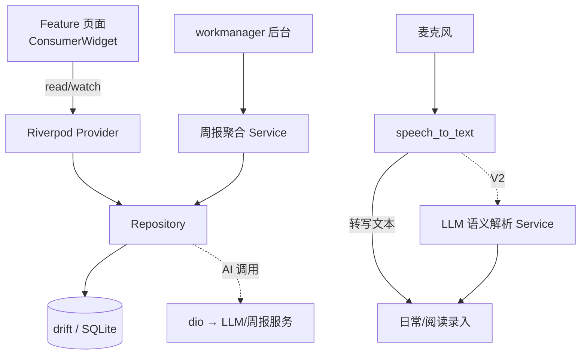
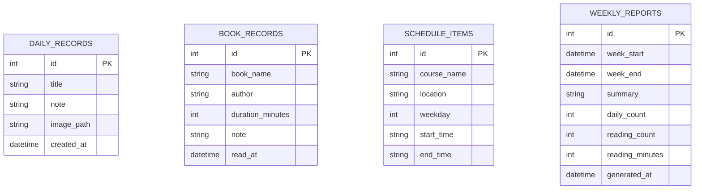
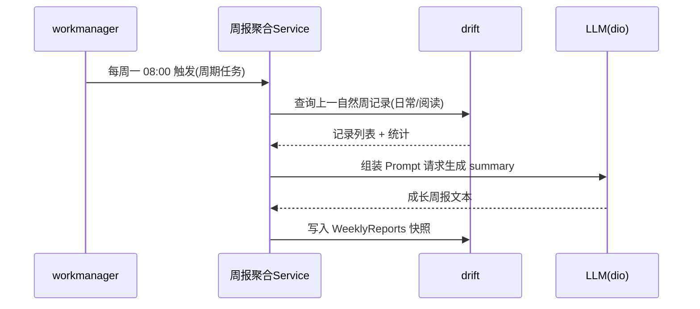
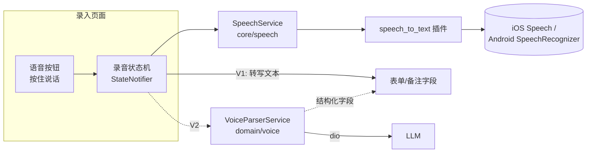
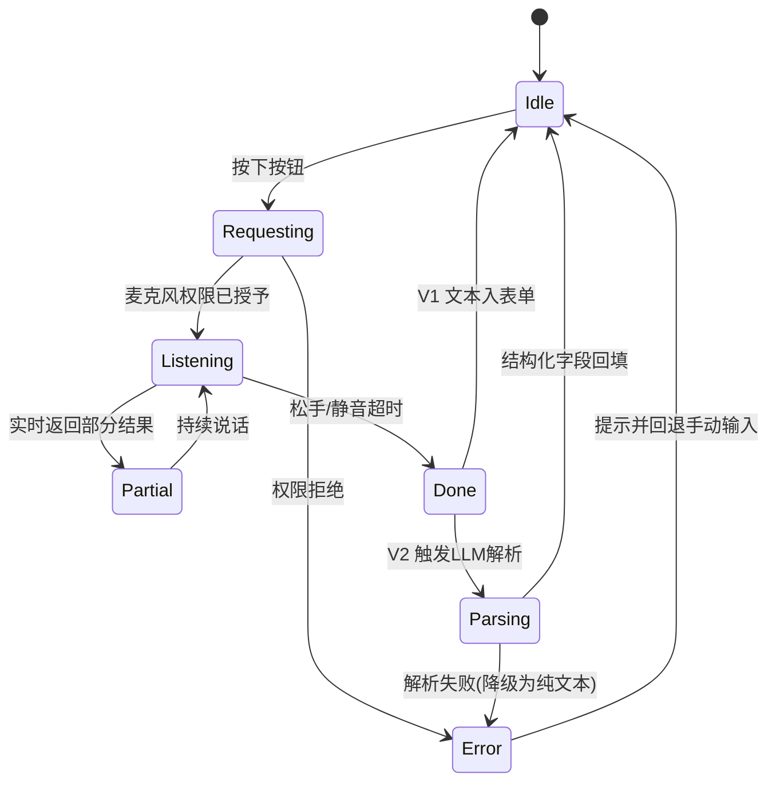

# Sprout 孩子成长记录 App · 技术方案

> 版本：v1.0　|　撰写：李硕　|　更新时间：2026-09-03
> 状态：技术设计评审稿

---

## 1. 背景与目标

### 1.1 项目背景

Sprout 是一款面向**家长**的孩子成长记录 App，当前记录对象为一名 6 岁儿童，后期规划让孩子本人也能参与使用。产品定位是"轻量、快速、可沉淀"的家庭成长档案工具，帮助家长把碎片化的日常、阅读、课程等信息结构化地记录下来，并通过 AI 周报把零散记录自动汇总成有温度的成长回顾。

### 1.2 核心功能范围

| 模块 | 说明 |
| --- | --- |
| 课表管理 | 维护孩子每周固定课程（时间、地点、科目） |
| 日常事项记录 | 记录晚上 / 周末的日常点滴，支持文字、图片，**并新增语音快速记录** |
| 阅读记录 | 书单管理 + 章节进度打卡 + 阅读时长统计 |
| 日历视图 | 以日历为入口浏览所有维度的历史记录 |
| AI 周报 | 每周后台自动汇总本周记录，生成成长周报 |
| 语音输入（本次新增） | 家长腾不出手时通过语音快速录入记录，V1 系统转写、V2 LLM 结构化解析 |

### 1.3 设计目标与约束

- **本地优先（Local-First）**：核心数据全部落地本地 SQLite，无网络也能完整使用，保护儿童隐私。
- **录入极致快**：从"想记录"到"记录完成"路径尽可能短，语音输入是本目标的关键抓手。
- **可演进**：架构需支撑从"家长单人使用"到"多设备 / 孩子参与 / 云同步"的平滑演进，避免早期过度设计。
- **儿童数据合规**：涉及未成年人信息，隐私与数据安全优先级高于功能丰富度。

---

## 2. 技术选型（方案选型）

### 2.1 选型总览

| 领域 | 选型 | 版本 | 定位 |
| --- | --- | --- | --- |
| 跨端框架 | **Flutter** | SDK ≥ 3.3.0 | iOS + Android 一套代码 |
| 状态管理 | **Riverpod** (`flutter_riverpod`) | ^2.5.1 | 依赖注入 + 响应式状态 |
| 路由 | **go_router** | ^13.0.0 | 声明式路由 |
| 本地数据库 | **drift** (SQLite) | ^2.18.0 | 类型安全的结构化存储 |
| 轻量存储 | **shared_preferences** | ^2.2.3 | 配置 / 偏好项 |
| 图片选择 | **image_picker** | ^1.1.2 | 相册 / 拍照 |
| 后台任务 | **workmanager** | ^0.5.2 | 周报定时触发 |
| 网络请求 | **dio** | ^5.4.3+1 | AI 周报 / 语音语义解析调用 |
| 国际化 / 日期 | **intl** | ^0.19.0 | 日期格式化 |
| 语音输入（新增） | **speech_to_text** | ^6.6.x（建议） | 系统原生语音转文字 |

> 上表中除 `speech_to_text` 为本次新增引入外，其余均已在 `pubspec.yaml` 中锁定，本方案对现有选型做确认与理由沉淀。

### 2.2 关键选型对比与理由

#### 2.2.1 跨端框架：Flutter

| 候选 | 优势 | 劣势 | 结论 |
| --- | --- | --- | --- |
| **Flutter** | 一套代码双端；自绘引擎 UI 一致性高；动画 / 日历等自定义 UI 表现好；生态完善 | 包体略大 | ✅ 采用 |
| React Native | 生态大、可复用 Web 技能 | 桥接性能损耗、原生一致性弱于 Flutter | ❌ |
| 原生双端 | 性能与体验上限最高 | 双倍开发成本，家庭级项目投入过重 | ❌ |

**结论**：家庭工具型 App 强调开发效率与双端一致体验，Flutter 是最优解。

#### 2.2.2 状态管理：Riverpod

- 相比 Provider：编译期安全，`ProviderScope` 可测试性强，无需 `BuildContext` 即可读取。
- 相比 Bloc：样板代码更少，适合本项目"仓库 + 页面状态"这种中等复杂度。
- 已在 `main.dart` 用 `ProviderScope` 包裹，`app.dart` 用 `ConsumerWidget` 消费，数据库与各 Repository 均以 `Provider` 暴露，选型落地一致。

#### 2.2.3 本地数据库：drift

| 候选 | 特点 | 结论 |
| --- | --- | --- |
| **drift** | 基于 SQLite，编译期生成类型安全 DAO，支持复杂查询 / 迁移 / 响应式流（`watch`） | ✅ 采用 |
| sqflite | 轻但需手写 SQL，类型不安全 | ❌ |
| Hive / Isar | KV / NoSQL 快，但结构化关联查询（如按周聚合）弱 | ❌ |

**结论**：周报需要按时间区间做跨表聚合统计，日历视图需要多维度结构化查询，drift 的关系型能力与类型安全最契合。

#### 2.2.4 后台任务：workmanager

- AI 周报需要"每周固定时间"在后台无感触发，`workmanager` 封装了 Android `WorkManager` 与 iOS `BGTaskScheduler`，是跨端周期任务的标准方案。
- 注意 iOS 后台执行时机由系统调度、不保证精确，需配合"打开 App 时补偿生成"策略（见 §6.3）。

#### 2.2.5 语音输入：speech_to_text（本次新增，详见 §7）

- V1 采用 `speech_to_text` 直接调用 iOS `Speech` / Android `SpeechRecognizer` 系统能力，**零服务端成本、隐私友好、离线可用**（多数机型支持设备端识别）。
- V2 在转写文本之上叠加 LLM 语义解析，把自然语言拆解成结构化字段（如书名 + 章节进度）。

---

## 3. 整体架构

### 3.1 分层架构

采用经典的**三层分层架构（Presentation / Domain / Data）**，配合 Riverpod 做依赖注入，保证 UI 与数据解耦、易测试、易演进。

```
┌─────────────────────────────────────────────────────────┐
│                    Presentation 表现层                     │
│   features/{home,daily,reading,schedule,report}           │
│   Widget (ConsumerWidget) + Page State (StateNotifier)    │
└───────────────────────────┬─────────────────────────────┘
                            │ watch / read (Riverpod)
┌───────────────────────────▼─────────────────────────────┐
│                     Domain 领域层                          │
│   models/ (实体)  +  service/ (周报聚合、语音语义解析)       │
└───────────────────────────┬─────────────────────────────┘
                            │ 依赖抽象
┌───────────────────────────▼─────────────────────────────┐
│                      Data 数据层                           │
│   repositories/ (仓库)  →  local/ (drift DB) + remote(dio) │
└─────────────────────────────────────────────────────────┘
```

- **Presentation**：只负责渲染与交互，通过 Riverpod `watch` 订阅状态，`read` 触发动作。
- **Domain**：领域实体（`DailyRecord` / `WeeklyReport` 等）与领域服务（周报聚合、语音解析），不依赖具体 UI 与存储实现。
- **Data**：Repository 屏蔽数据来源，本地走 drift，远程（AI）走 dio。

### 3.2 目录结构（现状 + 规划）

```
lib/
├── main.dart                      # 入口：ProviderScope
├── app.dart                       # MaterialApp.router
├── core/                          # 基础设施（无业务）
│   ├── router/app_router.dart     # go_router 路由表
│   ├── theme/app_theme.dart       # M3 主题（seed 绿色）
│   └── utils/date_util.dart       # 日期工具（周起止计算等）
├── data/                          # 数据层
│   ├── local/
│   │   ├── app_database.dart      # drift 表定义 + DB
│   │   └── database_provider.dart # DB 的 Riverpod Provider
│   ├── models/                    # 领域实体
│   └── repositories/              # 各业务仓库
├── shared/                        # 跨模块复用 UI
│   └── widgets/empty_placeholder.dart
└── features/                      # 按业务分层
    ├── home/                      # 首页 / 日历入口
    ├── daily/                     # 日常记录
    ├── reading/                   # 阅读打卡
    ├── schedule/                  # 课表
    └── report/                    # 周报
新增（本方案）：
    ├── core/speech/               # 语音输入基础能力封装
    ├── domain/report/             # 周报聚合服务
    └── domain/voice/              # V2 语音语义解析服务
```

### 3.3 模块依赖与数据流



### 3.4 Riverpod Provider 拓扑

- `appDatabaseProvider`（单例 DB，`onDispose` 关闭）
- `dailyRepositoryProvider` / `readingRepositoryProvider` / `scheduleRepositoryProvider` / `reportRepositoryProvider`（依赖 `appDatabaseProvider`）
- `appRouterProvider`（路由）
- 规划新增：`speechServiceProvider`（语音能力）、`reportGeneratorProvider`（周报聚合）、`voiceParserProvider`（V2 语义解析）
- 页面状态用 `StateNotifierProvider` / `AsyncNotifierProvider` 承载列表加载、录音状态机等。

---

## 4. 数据模型设计

### 4.1 ER 概览



各表当前相互独立（无外键关联），周报通过时间区间 `[week_start, week_end)` 对前三张记录表做聚合。

### 4.2 表结构（drift `Table` 定义，现状）

| 表 | 关键字段 | 用途 |
| --- | --- | --- |
| `DailyRecords` | `title` / `note` / `imagePath` / `createdAt` | 日常事项，支持图片，`createdAt` 供日历与周报按天聚合 |
| `BookRecords` | `bookName` / `author` / `durationMinutes` / `readAt` | 阅读打卡，`durationMinutes` 供阅读时长统计 |
| `ScheduleItems` | `courseName` / `location` / `weekday`(1–7) / `startTime` / `endTime` | 每周固定课程，`weekday` 支撑按天查询 |
| `WeeklyReports` | `weekStart` / `weekEnd` / `summary` / `dailyCount` / `readingCount` / `readingMinutes` / `generatedAt` | 周报快照，冗余统计字段避免重复计算 |

### 4.3 演进规划（结合语音与阅读进度）

当前 schemaVersion = 1。后续演进需通过 drift 的 `MigrationStrategy` 递增管理，规划字段：

- **`BookRecords` 增加 `chapter` / `progress`**：支撑"章节进度打卡"完整语义（现有仅有时长），也是 V2 语音结构化解析的落库目标。
- **记录表统一增加 `source` 字段**（`manual` / `voice`）：标记录入来源，便于统计语音输入使用率、周报中体现"本周语音记录 N 条"。
- **`DailyRecords` 增加 `category`**（晚上 / 周末 / 其他）：贴合"晚上/周末记录"的产品语义，日历视图可分类着色。

> 迁移原则：只增不删、字段默认值兜底、每次升 `schemaVersion` 并补充迁移测试。

---

## 5. 核心功能模块设计

### 5.1 首页 / 日历视图（home）

- 现状：`HomePage` 为功能宫格入口 + "今天"卡片。
- 规划：引入 `table_calendar`（或自绘）作为主入口，日历上标记有记录的日期（打点），点击某天下钻查看该日的日常 / 阅读 / 课程聚合。
- 数据来源：跨 `DailyRecords` / `BookRecords` / `ScheduleItems` 按日期聚合，建议在 Repository 层提供 `fetchByDate(DateTime)` 统一接口。

### 5.2 日常记录（daily）

- 现状：`DailyPage` 为空态占位 + FAB。
- 规划：列表按 `createdAt` 倒序；录入表单含标题、备注、图片（`image_picker`）、**语音按钮**；支持编辑 / 删除（Repository 已具备 `update` / `remove`）。

### 5.3 阅读记录（reading）

- 现状：`ReadingPage` 为空态占位。
- 规划：
  - 书单维度：按 `bookName` 聚合，展示累计时长与打卡次数；
  - 打卡维度：单次记录书名、章节 / 进度、时长、感想；
  - 语音录入直达（V2 自动填书名 + 章节）。

### 5.4 课表管理（schedule）

- 现状：`ScheduleRepository` 已支持 `fetchByWeekday`。
- 规划：周视图网格（周一至周日 × 时间段），支持增删课程；首页"今日课程"卡片复用 `fetchByWeekday(today.weekday)`。

### 5.5 周报（report）

- 现状：`ReportRepository` 支持按 `weekStart` 倒序读取。
- 规划：周报列表 + 详情页；详情展示 AI 生成的 `summary` 与本周统计（日常数、阅读次数、阅读分钟数）。详见 §6。

---

## 6. AI 周报生成方案

### 6.1 触发机制



- 用 `workmanager` 注册 **每周一次**的周期任务（Android 侧 `PeriodicWorkRequest`）。
- 周区间由 `DateUtil.startOfWeek` 计算，聚合上一自然周 `[weekStart, weekEnd)` 数据。

### 6.2 生成流程（三步）

1. **聚合**：跨表统计 `dailyCount` / `readingCount` / `readingMinutes`，并抽取本周记录要点（标题、书名、感想）。
2. **生成**：将统计 + 要点组装成 Prompt，经 `dio` 调用 LLM，产出自然语言 `summary`（温暖、面向家长的口吻）。
3. **落库**：写入 `WeeklyReports`，冗余统计字段随快照保存，避免二次计算。

### 6.3 容错与降级

- **iOS 后台不保证精确**：App 启动时检查"上周是否已生成"，未生成则补偿触发（幂等：以 `weekStart` 去重）。
- **网络失败 / LLM 不可用**：先落库统计数据 + 本地模板拼接的降级 `summary`，标记待重生成；恢复网络后可手动/自动刷新。
- **隐私**：调用 LLM 前对内容做最小化处理，避免上传可识别儿童身份的敏感信息（见 §8.3）。

---

## 7. 语音输入模块（本次新增重点）

### 7.1 需求与价值

家长在陪娃、做家务、哄睡等场景常常"腾不出手"打字，语音输入把"记录"这件事的门槛从"停下来打字"降到"说一句话"，是提升记录频次与留存的关键抓手。产品目标：**按住说话 → 松手即成文 → 一键入库**。

### 7.2 分阶段选型（V1 系统转写 → V2 LLM 语义解析）

| 维度 | V1：系统原生转写 | V2：转写 + LLM 语义解析 |
| --- | --- | --- |
| 核心能力 | 语音 → 纯文本 | 语音 → 文本 → 结构化字段 |
| 技术选型 | `speech_to_text` 插件 | V1 之上叠加 LLM（`dio` 调用） |
| 底层 | iOS `Speech` / Android `SpeechRecognizer` | 转写文本作为 LLM 输入 |
| 成本 | 零服务端成本 | 按 LLM 调用计费 |
| 隐私 | 多数机型设备端识别，隐私友好 | 需上传文本，做最小化脱敏 |
| 网络 | 多数场景离线可用 | 需要网络 |
| 典型效果 | 「今天读了三只小猪读到第二章」→ 落为一段备注 | 自动拆出 `书名=三只小猪`、`章节=第2章` 并填入阅读表单 |

**决策**：V1 先上，快速覆盖"语音转文字快速记录"的主诉求；V2 作为增强，在阅读 / 日常录入场景把自然语言变成结构化数据，减少家长二次编辑。

### 7.3 选型对比：为什么是 speech_to_text

| 候选 | 优势 | 劣势 | 结论 |
| --- | --- | --- | --- |
| **speech_to_text** | 直接封装系统 STT，双端统一 API；免费、隐私友好、可离线；集成成本低 | 识别精度依赖系统、长语音有时限 | ✅ V1 采用 |
| 云端 ASR（如各家语音服务） | 精度高、支持长音频与领域词 | 有成本、需上传音频、隐私成本高 | ❌ 家庭场景过重 |
| `record` + 自训模型 | 完全可控 | 工程量巨大，不现实 | ❌ |

### 7.4 模块架构

在 `core/speech/` 下封装一层与业务无关的语音能力，向上通过 Riverpod 暴露，业务页面只消费状态、不关心底层实现。



**分层职责**

- `SpeechService`（`core/speech/speech_service.dart`）：封装初始化、权限、`listen` / `stop`、部分结果回调、错误与超时；对外暴露 `Stream<SpeechState>`。
- `speechServiceProvider`：Riverpod 单例，管理插件生命周期。
- 录音状态机（`StateNotifier`）：维护 `idle / listening / partial / done / error` 状态，驱动 UI（波形、实时文字）。
- `VoiceParserService`（V2，`domain/voice/`）：接收转写文本 + 目标场景（阅读 / 日常），调用 LLM 返回结构化 JSON，映射到对应 `Companion` 落库。

### 7.5 交互与状态流转



### 7.6 权限与平台配置

- **iOS**：`Info.plist` 增加 `NSMicrophoneUsageDescription`、`NSSpeechRecognitionUsageDescription`（文案需面向家长说明用途）。
- **Android**：`AndroidManifest.xml` 增加 `RECORD_AUDIO` 权限，运行时动态申请；部分机型依赖 Google 语音服务。
- 首次使用引导 + 权限被拒后的降级路径（回退手动输入），避免功能"死路"。

### 7.7 V2 语义解析设计要点

- **Prompt 约定输出 JSON Schema**：如阅读场景 `{ "bookName": string, "chapter": string?, "durationMinutes": int?, "note": string }`，便于稳定解析。
- **场景路由**：录入入口已知业务类型（阅读 / 日常），把场景作为参数传入，提升解析准确率。
- **兜底策略**：LLM 解析失败或字段缺失时，降级为 V1 纯文本填入备注，绝不阻断记录；解析结果对家长可见、可一键修正后再入库。
- **隐私最小化**：仅上传转写文本、不上传音频；对可识别身份信息做脱敏（见 §8.3）。

---

## 8. 非功能性设计

### 8.1 性能

- **本地优先**：所有查询走本地 SQLite，交互无网络延迟；日历 / 列表大数据量时用 drift 的分页与 `watch` 流式刷新。
- **图片**：`image_picker` 取图后压缩再存，仅存本地路径（`imagePath`），避免大 blob 入库。
- **后台任务**：周报聚合放到后台 isolate（drift `createInBackground` 已用后台执行），不阻塞 UI。

### 8.2 离线与数据可靠性

- 全功能离线可用（含 V1 语音，多数机型设备端识别）。
- 仅"AI 周报生成"与"V2 语义解析"依赖网络，均设降级路径。
- 规划：本地数据库定期导出备份（JSON / SQLite 文件），支撑换机迁移。

### 8.3 隐私与儿童数据合规（高优先级）

- **数据不出端为默认**：核心成长记录默认只存本地，不做云上传。
- **AI 调用最小化**：仅在周报 / V2 解析时上传**文本**，且对姓名、学校、住址等可识别信息做脱敏或用代称（如"孩子"）。
- **不上传音频 / 图片**：语音只上传转写文本，图片始终留在本地。
- **明确授权**：麦克风 / 相册权限均需家长显式授权，文案说明用途。

### 8.4 可测试性

- Repository 依赖注入，测试用内存版 drift（`NativeDatabase.memory()`）替换。
- `SpeechService` / `VoiceParserService` 定义接口，测试用 fake 实现，隔离系统能力与 LLM。
- 周报聚合为纯函数式服务，便于单元测试统计逻辑。

---

## 9. 演进路线（Roadmap）

| 阶段 | 目标 | 关键交付 |
| --- | --- | --- |
| **M1 基础可用** | 四大记录 + 日历浏览闭环 | 日常 / 阅读 / 课表增删改查、日历下钻、DB 迁移到含 `chapter/progress/source` |
| **M2 语音 V1** | 语音快速记录 | `speech_to_text` 接入、`SpeechService` 封装、按住说话交互、权限链路 |
| **M3 AI 周报** | 周报自动生成 | `workmanager` 周期任务、聚合服务、LLM 生成 + 降级、补偿触发 |
| **M4 语音 V2** | 语义结构化 | `VoiceParserService`、场景化 Prompt、结构化回填与可修正 |
| **M5 演进** | 多设备 / 孩子参与 | 数据备份导出、（可选）云同步、儿童使用模式 |

---

## 10. 风险与应对

| 风险 | 影响 | 应对 |
| --- | --- | --- |
| iOS 后台任务不保证精确触发 | 周报可能延迟 | App 启动补偿生成 + 幂等去重 |
| 系统语音识别精度 / 方言 | V1 转写不准 | 提供实时文字可编辑；引导安静环境；V2 用 LLM 纠错 |
| LLM 成本 / 可用性 | V2 与周报受影响 | 降级为本地模板；控制调用频次；结果缓存 |
| 儿童隐私合规 | 合规风险 | 本地优先、最小上传、脱敏、显式授权 |
| DB 迁移出错 | 数据丢失 | 只增不删、迁移测试、升级前自动备份 |
| 语音权限被拒 | 功能不可用 | 明确降级到手动输入，不阻断主流程 |

---

## 附录：本次新增依赖

```yaml
dependencies:
  speech_to_text: ^6.6.0   # 语音输入 V1：系统原生转写
  # table_calendar: ^3.1.0 # （可选）日历视图组件
```

> 说明：`dio` 已在依赖中，可复用于 AI 周报与 V2 语义解析的 LLM 调用；无需新增网络库。
